# BÁO CÁO KHÓA LUẬN TỐT NGHIỆP ĐỊNH HƯỚNG KHỞI NGHIỆP VÀ ĐỔI MỚI SÁNG TẠO

## Xây dựng ứng dụng web học tiếng Nhật sơ cấp tích hợp chatbot AI RAG và hệ thống gợi ý lộ trình học dựa trên hành vi người dùng

**Trường:** Trường Đại học Công nghệ Thông tin và Truyền thông Việt - Hàn  
**Khoa:** Khoa Khoa học máy tính  
**Sinh viên thực hiện:** Nguyễn Văn Tuấn  
**Mã sinh viên:** 22CE089  
**Lớp:** 22SE1B  
**Ngành:** Kỹ thuật phần mềm  
**Giảng viên hướng dẫn:** ThS. Ngô Lê Quân  
**Sản phẩm:** Nihongo AI Study  
**Năm:** 2026

---

## Trang nội dung

### Danh mục bảng

| Mã | Tên bảng |
|---|---|
| Bảng 2.1 | So sánh một số nền tảng học ngoại ngữ và định vị sản phẩm |
| Bảng 2.2 | Yêu cầu chức năng của hệ thống |
| Bảng 2.3 | Yêu cầu phi chức năng của hệ thống |
| Bảng 3.1 | Công nghệ sử dụng trong sản phẩm |
| Bảng 3.2 | Các thực thể dữ liệu chính |
| Bảng 4.1 | Kết quả kiểm thử hệ thống |
| Bảng 4.2 | Business Model Canvas |

### Danh mục hình

| Mã | Tên hình |
|---|---|
| Hình 3.1 | Kiến trúc tổng thể hệ thống |
| Hình 3.2 | Luồng chatbot RAG |
| Hình 3.3 | Luồng gợi ý lộ trình học |
| Hình 3.4 | Mô hình dữ liệu chính |
| Hình 4.1 | Giao diện onboarding tạo lộ trình |
| Hình 4.2 | Giao diện learning path |
| Hình 4.3 | Giao diện phiên học từ vựng/ngữ pháp |
| Hình 4.4 | Giao diện chatbot Kami |
| Hình 4.5 | Giao diện bài đọc song ngữ |

### List of Abbreviations

| Abbreviation | Full term | Meaning in this report |
|---|---|---|
| AI | Artificial Intelligence | Trí tuệ nhân tạo |
| API | Application Programming Interface | Giao diện lập trình ứng dụng dùng để trao đổi dữ liệu giữa các thành phần hệ thống |
| BKT | Bayesian Knowledge Tracing | Mô hình ước lượng mức độ nắm vững kiến thức của người học |
| BMC | Business Model Canvas | Khung mô hình kinh doanh |
| CTA | Call to Action | Nút hoặc hành động chính mà người dùng cần thực hiện |
| DB | Database | Cơ sở dữ liệu |
| E2E | End-to-End | Kiểm thử toàn bộ luồng chức năng từ đầu đến cuối |
| ERD | Entity Relationship Diagram | Sơ đồ quan hệ thực thể của cơ sở dữ liệu |
| JLPT | Japanese-Language Proficiency Test | Kỳ thi năng lực tiếng Nhật |
| LLM | Large Language Model | Mô hình ngôn ngữ lớn |
| MVP | Minimum Viable Product | Sản phẩm khả dụng tối thiểu để kiểm chứng ý tưởng |
| N5 | JLPT N5 | Cấp độ sơ cấp nhất trong hệ thống JLPT |
| PWA | Progressive Web App | Ứng dụng web có thể hoạt động gần giống ứng dụng cài đặt |
| RAG | Retrieval-Augmented Generation | Kỹ thuật kết hợp truy xuất dữ liệu và mô hình sinh ngôn ngữ |
| REST | Representational State Transfer | Kiểu thiết kế API phổ biến cho ứng dụng web |
| SM-2 | SuperMemo 2 | Thuật toán ôn tập giãn cách được dùng trong hệ thống flashcard |
| SQL | Structured Query Language | Ngôn ngữ truy vấn cơ sở dữ liệu quan hệ |
| UI/UX | User Interface / User Experience | Giao diện người dùng và trải nghiệm người dùng |
| XAI | Explainable Artificial Intelligence | Trí tuệ nhân tạo có khả năng giải thích |

### Mục lục

1. List of Abbreviations  
2. Tóm tắt  
3. Chương 1. Giới thiệu  
4. Chương 2. Tổng quan tài liệu và cơ sở lý thuyết  
5. Chương 3. Thiết kế và phát triển sản phẩm  
6. Chương 4. Triển khai, đánh giá và mô hình kinh doanh  
7. Chương 5. Kết luận và kiến nghị  
8. Tài liệu tham khảo  
9. Phụ lục

---

## Tóm tắt

### Summary

Khóa luận tập trung xây dựng **Nihongo AI Study**, một sản phẩm web học tiếng Nhật sơ cấp theo định hướng đổi mới sáng tạo, kết hợp học tập cá nhân hóa, chatbot AI và gợi ý lộ trình học dựa trên dữ liệu. Sản phẩm hướng đến nhóm người học mới, đặc biệt là sinh viên, người tự học và người chuẩn bị cho kỳ thi JLPT N5. Đây là nhóm người dùng thường gặp các vấn đề như không biết bắt đầu từ đâu, dễ mất động lực khi học theo giáo trình cố định, thiếu phản hồi tức thời và thiếu một lộ trình học phù hợp với năng lực cá nhân. Điểm đổi mới của đề tài nằm ở việc chuyển trải nghiệm học từ mô hình “kho nội dung tĩnh” sang mô hình “trợ lý học tập cá nhân hóa”, trong đó hệ thống không chỉ cung cấp bài học mà còn theo dõi trạng thái học tập, giải thích nội dung bằng AI và đề xuất hành động tiếp theo cho từng người học.

### Methodology

Phương pháp thực hiện được triển khai theo hướng MVP nhằm nhanh chóng kiểm chứng giá trị cốt lõi của sản phẩm: người học có cần một nền tảng tiếng Nhật N5 có lộ trình cá nhân hóa, giải thích bằng tiếng Việt và hỗ trợ AI có căn cứ dữ liệu hay không. Nhóm chức năng được lựa chọn gồm onboarding, placement test, learning path, học từ vựng/ngữ pháp theo phiên, quiz, bài đọc song ngữ, chatbot Kami và recommendation engine. Về kỹ thuật, sản phẩm được phát triển bằng Next.js App Router, PostgreSQL và Prisma. Pipeline RAG được xây dựng dựa trên bảng `knowledge_chunks`, embedding và cơ chế truy xuất top-k để chatbot trả lời dựa trên nguồn tri thức có kiểm soát, giảm rủi ro sinh câu trả lời không chính xác. Hệ thống gợi ý học tập được thiết kế theo hướng rule-based XAI, kết hợp scoring lấy cảm hứng từ BKT và SM-2 để vừa đưa ra khuyến nghị, vừa giải thích được lý do khuyến nghị cho người học.

### Findings

Kết quả thực hiện cho thấy hệ thống đã hoàn thiện được một MVP có đầy đủ các chức năng chính để kiểm chứng ý tưởng sản phẩm. Người học có thể đăng ký, đăng nhập, tạo hồ sơ học, làm bài kiểm tra đầu vào, theo dõi learning path, học từ vựng/ngữ pháp, làm quiz, đọc bài song ngữ, tương tác với chatbot Kami, lưu mục học và xem lịch sử học tập. Về phía quản trị, hệ thống hỗ trợ quản lý nội dung học tập và dữ liệu liên quan. Về kiểm thử kỹ thuật, kết quả gần nhất cho thấy hệ thống build thành công, typecheck không lỗi và 6/6 test Playwright e2e vượt qua. Phát hiện chính của khóa luận là việc kết hợp RAG, dữ liệu học tập và recommendation có giải thích có thể tạo ra một hướng tiếp cận mới cho sản phẩm học tiếng Nhật: hệ thống không chỉ dạy theo bài có sẵn mà còn phản hồi, định hướng và cá nhân hóa quá trình học. Đây là cơ sở quan trọng để phát triển sản phẩm theo hướng AI tutor cho người học tiếng Nhật sơ cấp.

### Recommendations

Trong giai đoạn tiếp theo, sản phẩm nên được thử nghiệm với một nhóm người học thực tế để đo mức độ hữu ích của lộ trình cá nhân hóa, chất lượng phản hồi của chatbot AI, tỷ lệ hoàn thành phiên học và mức độ cải thiện kết quả quiz. Về phát triển sản phẩm, cần mở rộng dữ liệu học liệu, cải thiện chất lượng truy xuất của RAG, tinh chỉnh recommendation engine dựa trên dữ liệu sử dụng thực tế và bổ sung dashboard phân tích tiến độ học tập. Về định hướng đổi mới sáng tạo và thương mại hóa, Nihongo AI Study có thể phát triển theo mô hình freemium để tạo dòng tiền bền vững: bản miễn phí cung cấp lộ trình và nội dung cơ bản nhằm thu hút người dùng, trong khi gói Premium mở khóa AI tutor nhiều lượt hơn, gợi ý lộ trình nâng cao, dữ liệu bài đọc mở rộng, luyện JLPT, báo cáo học tập cá nhân và các tính năng theo dõi tiến độ chuyên sâu. Ngoài doanh thu thuê bao cá nhân, sản phẩm có thể bổ sung gói lớp học/trung tâm nhỏ với dashboard giáo viên, quản lý nhóm học viên và báo cáo tiến độ, từ đó mở rộng nguồn thu theo cả hướng B2C và B2B.

---

# Chương 1. Giới thiệu

## 1.1. Lý do chọn đề tài

### 1.1.1. Bối cảnh chuyển đổi số trong giáo dục

Trong bối cảnh chuyển đổi số, giáo dục trực tuyến không còn chỉ dừng ở việc đưa tài liệu lên website mà đang chuyển dần sang các mô hình học tập cá nhân hóa, có khả năng phản hồi theo dữ liệu và hỗ trợ người học theo thời gian thực. Người học ngoại ngữ ngày càng quen với việc học qua thiết bị cá nhân, học theo phiên ngắn và mong muốn nhận được gợi ý phù hợp với năng lực riêng. Đối với tiếng Nhật, nhu cầu học tập vẫn duy trì ổn định ở nhóm sinh viên, người tự học và người có định hướng làm việc với doanh nghiệp Nhật Bản. Theo Japan Foundation, khảo sát giáo dục tiếng Nhật ở nước ngoài năm 2021 ghi nhận khoảng 3,79 triệu người học tiếng Nhật trên toàn cầu, cho thấy đây là một thị trường học tập lớn và có tiềm năng phát triển sản phẩm số.

### 1.1.2. Vấn đề thực tiễn tồn tại

Tuy nhiên, người mới học tiếng Nhật thường gặp nhiều khó khăn thực tế. Thứ nhất, tiếng Nhật có hệ chữ viết khác biệt gồm hiragana, katakana và kanji, khiến người học dễ lúng túng trong giai đoạn bắt đầu. Thứ hai, tài liệu học truyền thống thường đi theo nội dung cố định, ít phản hồi theo năng lực cá nhân và chưa giúp người học biết nên học gì tiếp theo. Thứ ba, nhiều ứng dụng học ngoại ngữ phổ biến có ưu điểm về gamification và số lượng người dùng lớn, nhưng chưa tối ưu riêng cho người Việt học tiếng Nhật sơ cấp, đặc biệt là nhu cầu giải thích bằng tiếng Việt, học theo lộ trình JLPT N5 và nhận phản hồi tức thời khi gặp khó khăn.

### 1.1.3. Nhu cầu thị trường và người dùng

Từ góc độ thị trường, tiếng Nhật là một lĩnh vực học tập có nhu cầu ổn định do gắn với cơ hội học tập, thực tập, làm việc và giao tiếp với doanh nghiệp Nhật Bản. Nhóm người học sơ cấp, đặc biệt là người học N5, có nhu cầu cao đối với các công cụ giúp bắt đầu đúng hướng, học theo lộ trình rõ ràng, được giải thích bằng tiếng Việt và có thể tự học ngoài lớp. Đây cũng là nhóm phù hợp để triển khai sản phẩm giáo dục số theo mô hình freemium, trong đó bản miễn phí giúp người học tiếp cận nội dung cơ bản, còn các tính năng nâng cao như AI tutor, luyện JLPT, báo cáo tiến độ và dashboard học tập có thể phát triển thành gói Premium tạo dòng tiền.

### 1.1.4. Xu hướng công nghệ liên quan

Song song với nhu cầu thị trường, sự phát triển của mô hình ngôn ngữ lớn (LLM), Retrieval-Augmented Generation (RAG), học phân tích dữ liệu và hệ thống khuyến nghị mở ra cơ hội xây dựng các sản phẩm học tập thông minh hơn. RAG cho phép chatbot trả lời dựa trên nguồn dữ liệu nội bộ thay vì chỉ dựa vào kiến thức tổng quát của mô hình, từ đó giảm rủi ro sinh thông tin không có căn cứ. Hệ thống khuyến nghị có thể khai thác hồ sơ người học, kết quả quiz, tiến độ và activity log để đề xuất hành động học tập phù hợp. Vì vậy, đề tài **Nihongo AI Study** được lựa chọn nhằm xây dựng một sản phẩm học tiếng Nhật sơ cấp có khả năng ứng dụng thực tế, có điểm đổi mới công nghệ và có định hướng thương mại hóa theo mô hình sản phẩm giáo dục số.

## 1.2. Mục tiêu đề tài

### 1.2.1. Mục tiêu tổng quát

Mục tiêu tổng quát của đề tài là xây dựng một MVP ứng dụng web học tiếng Nhật sơ cấp tích hợp AI, có khả năng cá nhân hóa lộ trình học, hỗ trợ người học bằng chatbot có căn cứ dữ liệu và định hướng phát triển thành sản phẩm có thể thương mại hóa. Sản phẩm không chỉ đóng vai trò là kho nội dung học tập mà còn hướng đến mô hình trợ lý học tập cá nhân, giúp người học biết điểm bắt đầu, nhận phản hồi nhanh và có hành động học tiếp theo rõ ràng.

### 1.2.2. Mục tiêu cụ thể

Các mục tiêu cụ thể của đề tài được chia theo các nhóm công việc chính sau:

**Phân tích bài toán:**

- Phân tích bài toán học tiếng Nhật N5 của người mới học, xác định nhu cầu người dùng, vấn đề thực tiễn và yêu cầu hệ thống.

**Thiết kế hệ thống:**

- Thiết kế kiến trúc hệ thống web gồm frontend, backend API, cơ sở dữ liệu, module RAG, chatbot AI và recommendation engine.

**Xây dựng prototype/MVP:**

- Xây dựng prototype/MVP với các chức năng học tập cốt lõi như onboarding, placement test, learning path, từ vựng, ngữ pháp, quiz, bài đọc song ngữ, chatbot, lịch sử học tập và quản trị nội dung.
- Tích hợp chatbot Kami sử dụng RAG để trả lời câu hỏi học tập dựa trên dữ liệu từ vựng, ngữ pháp, quiz và bài đọc, có cơ chế nguồn tham khảo và fallback.
- Xây dựng hệ thống gợi ý hành động học tập có giải thích, sử dụng hồ sơ người học, kết quả placement, tiến độ, quiz attempts và activity log để đề xuất bước học tiếp theo.

**Đánh giá hiệu quả:**

- Đánh giá hiệu quả kỹ thuật của MVP thông qua typecheck, production build và kiểm thử Playwright e2e cho các luồng chức năng chính.

**Đề xuất mô hình kinh doanh:**

- Đề xuất mô hình kinh doanh, hướng nâng cấp Premium, khả năng tạo dòng tiền và lộ trình phát triển sản phẩm theo định hướng khởi nghiệp đổi mới sáng tạo.

### 1.2.3. Đóng góp chính của đề tài

Đề tài đóng góp một giải pháp kỹ thuật có khả năng ứng dụng thực tế trong lĩnh vực học tiếng Nhật sơ cấp. Về sản phẩm, khóa luận xây dựng được một MVP tích hợp đầy đủ các luồng học chính từ tạo hồ sơ, kiểm tra đầu vào, học theo lộ trình, làm quiz, đọc bài song ngữ đến tương tác với chatbot AI. Về công nghệ, đề tài kết hợp RAG, activity log và recommendation có giải thích để cá nhân hóa trải nghiệm học tập. Về định hướng đổi mới sáng tạo, đề tài đề xuất hướng phát triển sản phẩm theo mô hình freemium/Premium và khả năng mở rộng sang lớp học hoặc trung tâm tiếng Nhật nhỏ.

## 1.3. Đối tượng và phạm vi đề tài

### 1.3.1. Đối tượng người dùng

Đối tượng người dùng chính của sản phẩm là người mới bắt đầu học tiếng Nhật hoặc người đang ở giai đoạn sơ cấp, tương đương trình độ JLPT N5. Nhóm này thường cần một lộ trình rõ ràng, nội dung dễ tiếp cận, giải thích bằng tiếng Việt và các phiên học ngắn để duy trì thói quen học tập. Trong đó, nhóm sinh viên là đối tượng phù hợp vì có nhu cầu học ngoại ngữ để phục vụ học tập, thực tập, làm việc hoặc chuẩn bị cho cơ hội nghề nghiệp liên quan đến doanh nghiệp Nhật Bản.

Đối tượng người dùng thứ hai là người tự học hoặc người đã từng học tiếng Nhật nhưng bị gián đoạn, cần ôn lại từ vựng, ngữ pháp, kana và luyện quiz để củng cố kiến thức nền tảng. Với nhóm này, hệ thống cần hỗ trợ kiểm tra đầu vào, nhận diện điểm yếu và đề xuất nội dung ôn tập phù hợp thay vì bắt người học phải tự chọn bài từ đầu. Ngoài ra, trong định hướng mở rộng, sản phẩm có thể phục vụ giáo viên, lớp học nhỏ hoặc trung tâm tiếng Nhật cần công cụ theo dõi tiến độ, giao bài và hỗ trợ học viên ngoài giờ học.

### 1.3.2. Phạm vi nội dung và chức năng

Phạm vi nội dung của đề tài tập trung vào tiếng Nhật sơ cấp, tương đương JLPT N5. Hệ thống bao gồm các nhóm nội dung chính như từ vựng, ngữ pháp, quiz, bài đọc song ngữ và dữ liệu tri thức phục vụ chatbot RAG. Nội dung được ưu tiên theo hướng dễ học, có giải thích tiếng Việt, có ví dụ Nhật - Việt và phù hợp với người mới bắt đầu.

Về chức năng, MVP tập trung vào các luồng học tập cốt lõi gồm đăng ký/đăng nhập, onboarding tạo hồ sơ học, placement test, learning path, phiên học từ vựng, phiên học ngữ pháp, quiz, chatbot Kami, reading/TODAII, lưu mục học, lịch sử học tập và quản trị nội dung. Các chức năng này được lựa chọn để kiểm chứng giá trị chính của sản phẩm: người học có thể bắt đầu đúng trình độ, học theo lộ trình cá nhân hóa, nhận hỗ trợ từ AI và theo dõi tiến độ học tập.

Trong phạm vi khóa luận, sản phẩm chưa bao phủ đầy đủ các cấp độ N4-N1, chưa triển khai luyện nghe - nói chuyên sâu, chưa có hệ thống chấm phát âm, chưa có thanh toán thật và chưa có dashboard giáo viên hoàn chỉnh. Các chức năng thương mại hóa như gói Premium, subscription, giới hạn lượt AI tutor hoặc quản lý lớp học được đề xuất như hướng phát triển tiếp theo thay vì triển khai đầy đủ trong MVP.

### 1.3.3. Phạm vi công nghệ

Phạm vi công nghệ của hệ thống là ứng dụng web được xây dựng bằng Next.js App Router, React và TypeScript. Phần backend sử dụng Next.js Route Handlers để xây dựng các API phục vụ xác thực, dữ liệu học tập, quiz, chatbot, reading, recommendation và quản trị nội dung. Cơ sở dữ liệu sử dụng PostgreSQL, được quản lý thông qua Prisma nhằm đảm bảo mô hình dữ liệu rõ ràng, dễ mở rộng và phù hợp với việc lưu trữ thông tin người dùng, tiến độ học, activity log, dữ liệu học liệu và tri thức cho RAG.

Module RAG lưu tri thức dưới dạng `knowledge_chunks` và embedding trong PostgreSQL. Khi có embedding, hệ thống thực hiện truy xuất ngữ nghĩa để tìm các nguồn liên quan đến câu hỏi người dùng; khi thiếu embedding hoặc thiếu API key, hệ thống có cơ chế keyword fallback để đảm bảo chatbot vẫn có thể hoạt động trong môi trường demo. Chatbot AI gọi qua OpenRouter/OpenAI-compatible API, cho phép tích hợp mô hình ngôn ngữ lớn vào sản phẩm mà không cần tự huấn luyện mô hình từ đầu.

Recommendation engine trong MVP được triển khai theo hướng rule-based có giải thích, sử dụng dữ liệu từ learner profile, placement result, vocabulary progress, quiz attempts và activity log. Cách tiếp cận này phù hợp với giai đoạn MVP vì hệ thống chưa có lượng dữ liệu người dùng đủ lớn để huấn luyện mô hình machine learning riêng. Các kỹ thuật như BKT-inspired mastery estimate và SM-2-inspired review priority được dùng ở mức gợi ý/scoring nhằm hỗ trợ cá nhân hóa lộ trình học nhưng vẫn đảm bảo tính minh bạch khi giải thích khuyến nghị.

### 1.3.4. Giới hạn hệ thống

Do phạm vi khóa luận tập trung vào xây dựng và kiểm chứng MVP, hệ thống còn một số giới hạn. Thứ nhất, dữ liệu học liệu hiện được xây dựng và import ở mức phục vụ kiểm chứng chức năng, chưa thể đầy đủ và đa dạng như một sản phẩm thương mại hoàn chỉnh. Thứ hai, recommendation engine chủ yếu dựa trên rule và scoring thủ công, chưa huấn luyện mô hình AI riêng dựa trên hành vi người dùng thật. Thứ ba, RAG trong MVP ưu tiên khả năng tích hợp và demo, chưa tối ưu cho quy mô dữ liệu lớn bằng các công nghệ chuyên dụng như pgvector nâng cao, reranking hoặc vector database độc lập.

Ngoài ra, hệ thống chưa triển khai ứng dụng mobile native, chưa tích hợp thanh toán, chưa có cơ chế phân quyền phức tạp cho giáo viên/trung tâm và chưa có đánh giá thực nghiệm dài hạn với nhóm người học thật. Các chỉ số như retention, completion rate, mức cải thiện quiz score và mức độ hài lòng của người học mới dừng ở định hướng đo lường trong giai đoạn tiếp theo. Vì vậy, kết quả của khóa luận chủ yếu chứng minh tính khả thi kỹ thuật và giá trị sản phẩm ở mức MVP, chưa khẳng định đầy đủ hiệu quả học tập trên quy mô lớn.

### 1.3.5. Môi trường triển khai

Môi trường triển khai trong phạm vi khóa luận là ứng dụng web chạy trên môi trường phát triển cục bộ và có khả năng triển khai lên nền tảng hosting hỗ trợ Next.js, PostgreSQL và cấu hình biến môi trường cho API AI. Hệ thống cần các thành phần chính gồm Node.js/pnpm để chạy ứng dụng, PostgreSQL để lưu dữ liệu, Prisma để migrate/generate schema và API key của nhà cung cấp AI nếu muốn sử dụng đầy đủ chức năng chatbot RAG.

Khi triển khai thực tế, sản phẩm có thể được đưa lên các nền tảng như Vercel hoặc một server hỗ trợ Next.js, kết hợp cơ sở dữ liệu PostgreSQL được quản lý bởi dịch vụ cloud. Các biến môi trường cần được cấu hình cho database URL, secret xác thực, OpenRouter/OpenAI-compatible API key và các cấu hình liên quan đến RAG. Trong giai đoạn MVP, môi trường triển khai ưu tiên tính đơn giản, dễ kiểm thử và dễ demo; nếu mở rộng thành sản phẩm thương mại, hệ thống cần bổ sung hạ tầng giám sát, logging, backup dữ liệu, giới hạn lượt sử dụng AI, bảo mật thanh toán và tối ưu chi phí vận hành.

## 1.4. Ý nghĩa thực tiễn

### 1.4.1. Giải quyết vấn đề thực tế của người học

Về phía người học, Nihongo AI Study giúp giảm cảm giác mơ hồ khi bắt đầu học tiếng Nhật bằng cách tạo hồ sơ học, kiểm tra đầu vào và đề xuất lộ trình phù hợp. Thay vì phải tự chọn bài trong một kho nội dung lớn, người học được chuyển thành các hành động cụ thể như học từ mới, học ngữ pháp, làm quiz, ôn tập hoặc đọc bài song ngữ. Chatbot Kami hỗ trợ giải thích nội dung bằng tiếng Việt và trả lời dựa trên dữ liệu nội bộ, giúp người học nhận phản hồi nhanh hơn khi gặp khó khăn.

Sản phẩm cũng giải quyết vấn đề thiếu phản hồi tức thời trong quá trình tự học. Khi học qua sách, tài liệu rời rạc hoặc danh sách bài cố định, người học thường không biết lỗi sai đến từ đâu và nên học tiếp phần nào. Với hệ thống gợi ý dựa trên hồ sơ, placement test, quiz attempts, tiến độ và activity log, Nihongo AI Study có thể định hướng người học theo trạng thái hiện tại thay vì áp dụng một lộ trình giống nhau cho tất cả. Điều này giúp trải nghiệm học gần hơn với mô hình có gia sư cá nhân, nhưng có thể triển khai dưới dạng sản phẩm web.

### 1.4.2. Khả năng triển khai trong thực tế

Về khả năng triển khai, đề tài xây dựng sản phẩm dưới dạng ứng dụng web nên phù hợp với nhiều môi trường sử dụng như học cá nhân, nhóm sinh viên, cộng đồng tự học hoặc lớp học nhỏ. Người học chỉ cần thiết bị có trình duyệt để truy cập hệ thống, không cần cài đặt ứng dụng mobile native trong giai đoạn đầu. Cách triển khai này giúp giảm chi phí phát hành, dễ cập nhật nội dung và phù hợp với chiến lược MVP để kiểm chứng sản phẩm nhanh.

Về phía kỹ thuật, đề tài cho thấy khả năng kết hợp các công nghệ hiện đại như RAG, recommendation có giải thích, activity log và dashboard học tập trong một MVP giáo dục. Cách tiếp cận này phù hợp với bối cảnh đổi mới sáng tạo vì sản phẩm không chỉ số hóa tài liệu học mà còn sử dụng dữ liệu để cá nhân hóa trải nghiệm. Hệ thống có thể triển khai trên hạ tầng phổ biến như Next.js hosting, PostgreSQL cloud database và API AI bên thứ ba. Nếu mở rộng quy mô, hệ thống có thể bổ sung logging, monitoring, giới hạn lượt dùng AI, tối ưu chi phí API và cơ chế backup dữ liệu.

Sản phẩm cũng có thể được đưa vào thử nghiệm thực tế với một nhóm người học N5 để đo các chỉ số như tỷ lệ hoàn thành phiên học, tần suất quay lại, số quiz hoàn thành, mức cải thiện điểm quiz và mức độ hài lòng với chatbot AI. Các chỉ số này giúp đánh giá không chỉ khả năng chạy của hệ thống mà còn giá trị thực tế đối với quá trình học. Đây là bước quan trọng trước khi phát triển sản phẩm thành dịch vụ thương mại.

### 1.4.3. Khả năng mở rộng theo hướng startup

Về khả năng mở rộng startup, Nihongo AI Study có thể phát triển theo mô hình freemium. Bản miễn phí cung cấp lộ trình học cơ bản, một phần nội dung từ vựng/ngữ pháp, quiz giới hạn và số lượt hỏi AI nhất định nhằm thu hút người dùng mới. Gói Premium có thể tạo dòng tiền thông qua các tính năng giá trị cao hơn như AI tutor nhiều lượt hơn, gợi ý lộ trình nâng cao, luyện JLPT theo mục tiêu, bài đọc song ngữ mở rộng, báo cáo học tập cá nhân và dashboard phân tích tiến độ.

Ngoài thị trường cá nhân B2C, sản phẩm còn có thể mở rộng sang hướng B2B cho lớp học hoặc trung tâm tiếng Nhật nhỏ. Trong mô hình này, hệ thống có thể bổ sung dashboard giáo viên, quản lý nhóm học viên, giao bài, theo dõi tiến độ, báo cáo điểm quiz và phát hiện học viên có nguy cơ bỏ học. Đây là hướng mở rộng có tiềm năng vì nhiều lớp học nhỏ cần công cụ hỗ trợ ngoài giờ học nhưng không đủ nguồn lực để tự phát triển nền tảng riêng.

Về lộ trình phát triển, sản phẩm có thể mở rộng từ N5 lên N4-N1, bổ sung luyện nghe - nói, tích hợp spaced repetition đầy đủ, tối ưu RAG bằng pgvector hoặc vector database, và phát triển hệ thống thanh toán/subscription. Khi dữ liệu người dùng đủ lớn, recommendation engine có thể được cải thiện từ rule-based sang mô hình học máy hoặc mô hình lai, giúp cá nhân hóa sâu hơn. Nhờ đó, đề tài không chỉ có ý nghĩa như một sản phẩm kỹ thuật phục vụ khóa luận mà còn có khả năng phát triển thành một sản phẩm giáo dục số có giá trị thương mại.

---

# Chương 2. Tổng quan tài liệu và cơ sở lý thuyết

## 2.1. Tổng quan lĩnh vực

### 2.1.1. Xu hướng chuyển đổi số trong giáo dục

Chuyển đổi số trong giáo dục làm thay đổi cách người học tiếp cận tri thức. Nếu trước đây học trực tuyến chủ yếu là xem video, tải tài liệu hoặc làm bài tập trên website, thì các nền tảng hiện nay đang chuyển sang mô hình học tập có dữ liệu, có cá nhân hóa và có phản hồi theo thời gian thực. Người học không chỉ cần nội dung mà còn cần hệ thống biết họ đang ở đâu, còn yếu phần nào và nên học gì tiếp theo.

Trong lĩnh vực học ngoại ngữ, xu hướng này thể hiện rõ qua các mô hình học ngắn theo phiên, gamification, spaced repetition, kiểm tra năng lực định kỳ và phân tích tiến độ học tập. Việc học qua thiết bị cá nhân giúp người học có thể học mọi lúc, nhưng cũng đặt ra yêu cầu sản phẩm phải đủ rõ ràng, dễ duy trì thói quen và có khả năng giữ chân người dùng. Vì vậy, các nền tảng học ngoại ngữ hiện đại không chỉ cạnh tranh bằng số lượng nội dung mà còn bằng chất lượng trải nghiệm, mức độ cá nhân hóa và khả năng tạo động lực học lâu dài.

### 2.1.2. Thị trường học ngoại ngữ trực tuyến

Thị trường học ngoại ngữ trực tuyến tăng trưởng nhờ ba xu hướng chính: học qua thiết bị cá nhân, học ngắn theo phiên và cá nhân hóa bằng dữ liệu. Duolingo báo cáo trong Q1/2025 đạt 130,2 triệu người dùng hoạt động hằng tháng và 46,6 triệu người dùng hoạt động hằng ngày, cho thấy quy mô nhu cầu học ngoại ngữ trực tuyến rất lớn. Các con số này phản ánh việc người dùng đã quen với mô hình học ngoại ngữ qua ứng dụng và sẵn sàng duy trì thói quen học nếu sản phẩm có trải nghiệm đủ hấp dẫn.

Đối với tiếng Nhật, nhu cầu học tập gắn với nhiều mục tiêu như học tập, du học, thực tập, làm việc tại doanh nghiệp Nhật Bản hoặc thi chứng chỉ JLPT. Theo Japan Foundation, khảo sát giáo dục tiếng Nhật ở nước ngoài năm 2021 ghi nhận khoảng 3,79 triệu người học tiếng Nhật trên toàn cầu. Đây là cơ sở cho thấy tiếng Nhật vẫn là một thị trường học tập có nhu cầu ổn định. Tuy nhiên, với người Việt học tiếng Nhật sơ cấp, nhu cầu không chỉ nằm ở việc có nội dung học mà còn nằm ở cách giải thích bằng tiếng Việt, lộ trình theo JLPT N5, ví dụ song ngữ và hỗ trợ khi tự học.

### 2.1.3. Đặc thù của người học tiếng Nhật sơ cấp

Theo JLPT, N5 là cấp độ cơ bản nhất trong hệ thống N1-N5, yêu cầu người học hiểu một số tiếng Nhật cơ bản, bao gồm kiến thức ngôn ngữ như từ vựng, ngữ pháp, đọc hiểu và nghe. Với người mới bắt đầu, khó khăn không chỉ là ghi nhớ từ vựng mà còn là làm quen với hệ chữ viết hiragana, katakana, kanji cơ bản và cấu trúc câu khác biệt so với tiếng Việt.

Người học N5 thường cần một hệ thống có ba đặc điểm. Thứ nhất, nội dung phải được chia nhỏ thành các phiên học ngắn để giảm áp lực bắt đầu. Thứ hai, hệ thống cần giải thích bằng tiếng Việt và cung cấp ví dụ song ngữ để người học dễ hiểu ngữ cảnh sử dụng. Thứ ba, hệ thống cần có cơ chế kiểm tra, ôn tập và gợi ý bước tiếp theo để người học không bị lạc trong kho nội dung. Đây là cơ sở để đề tài lựa chọn hướng xây dựng learning path, placement test, quiz, chatbot RAG và recommendation engine.

### 2.1.4. Xu hướng ứng dụng AI trong học tập

Sự phát triển của mô hình ngôn ngữ lớn (LLM) mở ra khả năng xây dựng các trợ lý học tập có thể giải thích kiến thức, trả lời câu hỏi và hỗ trợ người học theo ngữ cảnh. Tuy nhiên, nếu chatbot chỉ dựa vào kiến thức tổng quát của mô hình, câu trả lời có thể thiếu kiểm soát hoặc không bám sát dữ liệu học liệu của hệ thống. Vì vậy, Retrieval-Augmented Generation (RAG) trở thành một hướng tiếp cận phù hợp cho sản phẩm giáo dục, vì chatbot có thể truy xuất nguồn tri thức nội bộ trước khi tạo câu trả lời.

Bên cạnh chatbot, hệ thống khuyến nghị học tập cũng là một xu hướng quan trọng. Thay vì hiển thị cùng một danh sách bài cho tất cả người học, hệ thống có thể dùng hồ sơ, điểm kiểm tra, tiến độ và lịch sử hoạt động để đề xuất bài học phù hợp. Trong sản phẩm giáo dục, tính giải thích của khuyến nghị rất quan trọng vì người học cần hiểu vì sao mình nên học bài đó. Do đó, đề tài lựa chọn hướng recommendation có giải thích, phù hợp với bối cảnh MVP và định hướng đổi mới sáng tạo.

## 2.2. So sánh sản phẩm liên quan

### 2.2.1. Tiêu chí khảo sát

Để xác định khoảng trống thị trường và định vị sản phẩm, đề tài khảo sát một số nền tảng học ngoại ngữ/học tiếng Nhật phổ biến theo các tiêu chí sau:

- Mức độ phù hợp với người học tiếng Nhật sơ cấp.
- Khả năng giải thích nội dung bằng tiếng Việt.
- Có lộ trình cá nhân hóa hoặc kiểm tra đầu vào hay không.
- Có chatbot AI hoặc hỗ trợ hỏi đáp tức thời hay không.
- Có cơ chế ôn tập, quiz, bài đọc và theo dõi tiến độ hay không.
- Khả năng phát triển thành mô hình freemium/Premium.

### 2.2.2. So sánh các sản phẩm/hệ thống liên quan

| Sản phẩm | Ưu điểm | Hạn chế so với đề tài |
|---|---|---|
| Duolingo | Gamification tốt, lượng người dùng lớn, học ngắn theo ngày | Không tối ưu riêng cho người Việt học N5; giải thích ngữ pháp hạn chế |
| Anki | Flashcard mạnh, hỗ trợ spaced repetition | Cần tự tạo deck, ít onboarding và không có chatbot học tập |
| Bunpro | Mạnh về ngữ pháp tiếng Nhật | Chủ yếu tiếng Anh, chưa tối ưu tiếng Việt |
| Todaii Japanese | Có bài đọc, furigana, tin tức tiếng Nhật | Không tập trung vào learning path cá nhân hóa trong project này |
| Nihongo AI Study | Song ngữ Việt-Nhật, RAG chatbot, learning path, placement, session học | MVP còn giới hạn dữ liệu và chưa có mô hình ML huấn luyện riêng |

### 2.2.3. Nhận xét sau khảo sát

Các sản phẩm hiện có cho thấy thị trường học ngoại ngữ trực tuyến đã có nhu cầu lớn và nhiều mô hình thành công. Duolingo mạnh về gamification và thói quen học hằng ngày, nhưng không tập trung riêng vào người Việt học JLPT N5. Anki mạnh về flashcard và spaced repetition, nhưng phụ thuộc nhiều vào khả năng tự tổ chức nội dung của người học. Bunpro có thế mạnh về ngữ pháp tiếng Nhật nhưng chủ yếu phục vụ người học dùng tiếng Anh. Todaii Japanese cung cấp bài đọc và hỗ trợ furigana, phù hợp với luyện đọc, nhưng không phải một learning path cá nhân hóa hoàn chỉnh trong phạm vi đề tài này.

Khoảng trống mà Nihongo AI Study hướng đến là kết hợp các yếu tố: nội dung N5 song ngữ Việt - Nhật, onboarding và placement test, learning path, chatbot AI có căn cứ dữ liệu, recommendation có giải thích và định hướng thương mại hóa bằng gói Premium. Sản phẩm không cạnh tranh trực tiếp bằng quy mô dữ liệu ở giai đoạn đầu, mà tập trung vào trải nghiệm học cá nhân hóa cho một phân khúc cụ thể.

## 2.3. Phân tích thị trường và chiến lược

### 2.3.1. Phân tích SWOT

| Nhóm | Nội dung |
|---|---|
| Strengths | Tập trung N5, giải thích tiếng Việt, có chatbot RAG, learning path có hành động cụ thể, UI thân thiện |
| Weaknesses | Dữ liệu còn giới hạn, recommendation chủ yếu rule-based, chưa có mobile app |
| Opportunities | Nhu cầu học tiếng Nhật và học trực tuyến tăng; AI tutor trở thành xu hướng; có thể mở rộng B2C/B2B |
| Threats | Cạnh tranh từ ứng dụng lớn; chi phí API AI; chất lượng dữ liệu và bản quyền nội dung cần kiểm soát |

Từ SWOT có thể thấy lợi thế chính của sản phẩm nằm ở định vị ngách: người Việt học tiếng Nhật sơ cấp, cần giải thích bằng tiếng Việt và cần lộ trình học rõ ràng. Điểm yếu lớn nhất là dữ liệu và độ trưởng thành của thuật toán chưa thể so với sản phẩm thương mại lớn. Vì vậy, chiến lược phù hợp là phát triển theo MVP, kiểm chứng nhu cầu người dùng thật, mở rộng dữ liệu dần và dùng các tính năng Premium để tạo dòng tiền bù chi phí AI.

### 2.3.2. Phân tích PESTEL

| Yếu tố | Phân tích |
|---|---|
| Political | Quan hệ hợp tác Việt Nam - Nhật Bản tạo điều kiện cho nhu cầu học tiếng Nhật phục vụ học tập, lao động và giao lưu văn hóa |
| Economic | Người học có xu hướng tìm giải pháp học online chi phí thấp hơn lớp học truyền thống; mô hình freemium giúp giảm rào cản tiếp cận |
| Social | Sinh viên và người trẻ quen học qua điện thoại, web app, cộng đồng online; nhu cầu tự học và ôn thi chứng chỉ tăng |
| Technological | LLM, RAG, cloud database, web framework hiện đại giúp cá nhân hóa học tập với chi phí phát triển thấp hơn trước |
| Environmental | Sản phẩm số giảm phụ thuộc vào tài liệu giấy và lớp học vật lý, phù hợp xu hướng học linh hoạt |
| Legal | Cần chú ý bản quyền học liệu, quyền riêng tư dữ liệu người dùng, điều khoản sử dụng API AI và bảo mật thông tin tài khoản |

Phân tích PESTEL cho thấy môi trường bên ngoài có nhiều yếu tố thuận lợi cho sản phẩm giáo dục số, đặc biệt là nhu cầu học trực tuyến, sự phổ biến của AI và khả năng triển khai web app với chi phí thấp. Tuy nhiên, yếu tố pháp lý và bản quyền nội dung cần được kiểm soát nghiêm túc nếu sản phẩm phát triển thương mại.

### 2.3.3. Phân tích Porter Five Forces

| Áp lực cạnh tranh | Mức độ | Nhận xét |
|---|---|---|
| Cạnh tranh trong ngành | Cao | Có nhiều ứng dụng học ngoại ngữ và học tiếng Nhật đã có người dùng lớn |
| Đối thủ mới gia nhập | Trung bình | Công nghệ web/AI dễ tiếp cận hơn, nhưng xây dữ liệu chất lượng và giữ chân người dùng vẫn khó |
| Sản phẩm thay thế | Cao | Người học có thể dùng sách, lớp học, YouTube, app miễn phí hoặc flashcard |
| Quyền lực khách hàng | Cao | Người học có nhiều lựa chọn và nhạy cảm với giá; cần freemium để thu hút ban đầu |
| Quyền lực nhà cung cấp | Trung bình - cao | Phụ thuộc vào API AI, cloud hosting và database provider; cần tối ưu chi phí và fallback |

Từ Porter Five Forces, chiến lược cạnh tranh phù hợp không phải là làm một ứng dụng học ngoại ngữ tổng quát, mà là tập trung vào một phân khúc cụ thể: người Việt học tiếng Nhật N5 cần lộ trình, giải thích tiếng Việt và AI tutor có căn cứ dữ liệu. Định vị ngách giúp sản phẩm có cơ hội tạo khác biệt dù thị trường cạnh tranh cao.

## 2.4. System Requirements Identification

### 2.4.1. Functional Requirements

| Mã | Yêu cầu |
|---|---|
| FR1 | Người dùng có thể đăng ký, đăng nhập và duy trì phiên học |
| FR2 | Người dùng có thể tạo hồ sơ học gồm mục tiêu, trình độ kana, thời gian học và chủ đề quan tâm |
| FR3 | Hệ thống cung cấp placement test để xác định điểm bắt đầu tương đối |
| FR4 | Hệ thống hiển thị learning path và đề xuất task học tiếp theo |
| FR5 | Người dùng có thể học từ vựng qua kho từ và phiên học flashcard |
| FR6 | Người dùng có thể học ngữ pháp qua thư viện và phiên học ngữ pháp |
| FR7 | Người dùng có thể làm quiz, nộp bài, xem kết quả và giải thích |
| FR8 | Chatbot Kami trả lời câu hỏi học tập dựa trên RAG và hiển thị nguồn tham khảo khi có |
| FR9 | Người dùng có thể đọc bài song ngữ, bật furigana, nghe audio và lưu mục học |
| FR10 | Hệ thống ghi nhận activity log, lịch sử học tập và tiến độ người dùng |
| FR11 | Admin có thể quản lý dữ liệu từ vựng, ngữ pháp, quiz, bài đọc và tri thức RAG |
| FR12 | Hệ thống có thể phân biệt chức năng miễn phí và hướng mở rộng Premium trong tương lai |

### 2.4.2. Non-functional Requirements

| Nhóm | Yêu cầu |
|---|---|
| Usability | Giao diện dễ hiểu, phù hợp người mới học tiếng Nhật, ưu tiên luồng học rõ ràng |
| Reliability | Có fallback khi thiếu API AI, thiếu embedding hoặc dữ liệu bài đọc rỗng |
| Performance | Các trang học chính phản hồi đủ nhanh trong môi trường MVP; truy xuất RAG/top-k không gây treo UI |
| Security | API yêu cầu xác thực, route admin yêu cầu quyền admin, không lộ API key phía client |
| Maintainability | Mã nguồn tách module rõ ràng theo API, hooks, RAG, recommendation, onboarding và UI |
| Extensibility | Có thể mở rộng từ N5 lên N4-N1, thêm pgvector/vector database, mobile app hoặc dashboard giáo viên |
| Testability | Có thể kiểm thử bằng TypeScript typecheck, production build và Playwright e2e |
| Cost control | Có cơ chế fallback/giới hạn để kiểm soát chi phí API AI khi phát triển thương mại |

### 2.4.3. Yêu cầu dữ liệu

Hệ thống cần lưu dữ liệu người dùng, phiên đăng nhập, hồ sơ học tập, kết quả placement test, tiến độ từ vựng, kết quả quiz, activity log, lịch sử chatbot, saved items, bài đọc song ngữ và knowledge chunks cho RAG. Dữ liệu học liệu cần có cấu trúc đủ rõ để phục vụ cả giao diện học tập và truy xuất AI. Ví dụ, từ vựng cần có tiếng Nhật, kana/romaji, nghĩa tiếng Việt, ví dụ và dịch nghĩa; ngữ pháp cần có pattern, cấu trúc, ý nghĩa và ví dụ; bài đọc cần có tiêu đề, nội dung, level, category, furigana và câu hỏi đọc hiểu nếu có.

Đối với RAG, dữ liệu cần được chuyển thành các chunk tri thức có metadata như loại nội dung, tiêu đề, level, source và embedding. Metadata giúp chatbot ưu tiên nguồn phù hợp với câu hỏi và giúp hệ thống hiển thị nguồn tham khảo. Với recommendation, dữ liệu activity log và tiến độ học cần đủ nhất quán để xác định người học đã học gì, cần ôn gì và nên làm gì tiếp theo.

## 2.5. Cơ sở lý thuyết

### 2.5.1. Retrieval-Augmented Generation

RAG là kỹ thuật kết hợp mô hình sinh ngôn ngữ với bộ nhớ ngoài thông qua truy xuất tài liệu liên quan. Lewis và cộng sự (2020) đề xuất hướng kết hợp parametric memory của mô hình seq2seq với non-parametric memory từ nguồn tri thức ngoài, giúp cải thiện các tác vụ cần kiến thức. Trong đề tài, RAG được dùng để chatbot không chỉ trả lời theo kiến thức tổng quát mà còn dựa trên dữ liệu học tập nội bộ.

Quy trình RAG trong hệ thống gồm các bước: nhận câu hỏi của người học, truy xuất các knowledge chunks liên quan, xây dựng prompt có nguồn tham khảo, gọi mô hình ngôn ngữ và trả về câu trả lời kèm nguồn. Cách tiếp cận này phù hợp với sản phẩm giáo dục vì nội dung trả lời cần bám vào dữ liệu học liệu được kiểm soát, đặc biệt với các câu hỏi về từ vựng, ngữ pháp và bài đọc.

### 2.5.2. Embedding và truy xuất ngữ nghĩa

Embedding biểu diễn văn bản thành vector số để đo độ tương đồng ngữ nghĩa. Khi câu hỏi và tài liệu được biểu diễn trong cùng không gian vector, hệ thống có thể tìm các chunk gần nghĩa với câu hỏi thông qua cosine similarity hoặc các độ đo tương tự. Trong đề tài, embedding được lưu trong bảng `knowledge_chunks`, sau đó dùng để truy xuất top-k nguồn liên quan cho chatbot.

Trong trường hợp thiếu embedding hoặc API key, hệ thống sử dụng keyword retrieval như cơ chế dự phòng. Điều này phù hợp với MVP vì demo vẫn có thể hoạt động trong môi trường thiếu cấu hình AI đầy đủ. Tuy nhiên, khi mở rộng quy mô dữ liệu, hệ thống cần tối ưu bằng pgvector, vector database chuyên dụng hoặc reranking để cải thiện chất lượng truy xuất.

### 2.5.3. Hệ thống khuyến nghị học tập

Hệ thống khuyến nghị học tập sử dụng dữ liệu người học để chọn nội dung hoặc hành động phù hợp. Trong bối cảnh đề tài, dữ liệu đầu vào gồm learner profile, placement result, vocabulary progress, quiz attempts và activity log. Đầu ra không chỉ là một bài học mà là một hành động cụ thể như học từ mới, ôn tập, làm quiz, học ngữ pháp hoặc đọc bài song ngữ.

Trong MVP, đề tài dùng rule-based recommendation có giải thích thay vì mô hình học máy phức tạp. Cách tiếp cận này minh bạch, dễ kiểm soát và phù hợp khi dữ liệu người dùng chưa đủ lớn. Recommendation engine kết hợp BKT-inspired mastery estimate từ quiz để ước lượng mức nắm vững kiến thức và SM-2-inspired review priority để ưu tiên các mục cần ôn. Đây không phải là triển khai đầy đủ BKT/SM-2 chuẩn, mà là cách vận dụng ý tưởng để tạo scoring phù hợp với MVP.

### 2.5.4. Explainable AI trong phản hồi học tập

Explainable AI trong giáo dục nhấn mạnh việc hệ thống không chỉ đưa ra kết quả mà còn phải giải thích cơ sở của kết quả đó. Với người học, một khuyến nghị như “hãy ôn ngữ pháp này” sẽ hữu ích hơn nếu đi kèm lý do: điểm quiz thấp, lâu chưa ôn, hoặc đã học từ vựng liên quan. Điều này giúp người học tin tưởng hơn vào hệ thống và tự điều chỉnh quá trình học.

Bài báo *Explainable AI for Data-Driven Feedback and Intelligent Action Recommendations to Support Students' Self-Regulation* nhấn mạnh việc thu thập bằng chứng học tập, ước lượng trạng thái người học, tạo khuyến nghị hành động và giải thích lý do. Đề tài kế thừa tinh thần này bằng cách trả về `action`, `expectedOutcome`, `riskScore`, `masteryScore`, `learningState` và `evidence` trong recommendation engine, nhưng không tuyên bố tái tạo đầy đủ mô hình ML/LIME của bài báo.

### 2.5.5. Spaced repetition và SM-2

Spaced repetition là phương pháp ôn tập giãn cách, dựa trên nguyên tắc người học nên ôn lại kiến thức vào thời điểm gần quên để tăng hiệu quả ghi nhớ dài hạn. SM-2 là một thuật toán nổi tiếng được dùng trong các hệ thống flashcard như SuperMemo/Anki, trong đó khoảng cách ôn tập được điều chỉnh dựa trên mức độ nhớ của người học.

Trong đề tài, ý tưởng SM-2 được sử dụng ở mức inspired scoring để ưu tiên các mục cần ôn, chưa triển khai đầy đủ interval, easiness factor và repetition count như thuật toán gốc. Cách làm này phù hợp với phạm vi MVP vì vẫn hỗ trợ định hướng ôn tập nhưng không làm hệ thống quá phức tạp khi dữ liệu người dùng còn ít.

### 2.5.6. Bayesian Knowledge Tracing

Bayesian Knowledge Tracing (BKT) là mô hình ước lượng xác suất người học đã nắm vững một kỹ năng dựa trên các lần trả lời đúng/sai. Trong giáo dục thông minh, BKT thường được dùng để theo dõi mastery theo từng kỹ năng hoặc chủ đề. Ý tưởng cốt lõi là trạng thái hiểu bài của người học không quan sát trực tiếp được, nhưng có thể ước lượng từ hành vi làm bài.

Trong đề tài, BKT được dùng ở mức ý tưởng để xây dựng mastery score từ kết quả quiz và tiến độ học. Hệ thống không triển khai đầy đủ mô hình xác suất BKT chuẩn, mà sử dụng cách ước lượng đơn giản hơn để phù hợp với MVP. Mastery score giúp recommendation engine phân biệt nội dung người học đã nắm tương đối tốt và nội dung cần củng cố.

### 2.5.7. Mô hình freemium trong sản phẩm giáo dục số

Freemium là mô hình kinh doanh trong đó sản phẩm cung cấp một phần tính năng miễn phí để thu hút người dùng, sau đó tạo doanh thu từ các tính năng nâng cao. Trong sản phẩm giáo dục số, mô hình này phù hợp vì người học thường muốn trải nghiệm trước khi trả phí. Các tính năng miễn phí có thể gồm nội dung cơ bản, một số quiz và lộ trình học ban đầu; các tính năng Premium có thể gồm AI tutor nhiều lượt hơn, luyện thi chuyên sâu, báo cáo tiến độ, dữ liệu mở rộng và dashboard cá nhân.

Đối với Nihongo AI Study, freemium giúp giảm rào cản tiếp cận cho sinh viên và người mới học, đồng thời tạo dòng tiền để duy trì chi phí API AI, hosting, database và phát triển nội dung. Ngoài B2C, sản phẩm có thể mở rộng sang B2B thông qua gói lớp học/trung tâm với dashboard giáo viên, quản lý học viên và báo cáo tiến độ.

---

# Chương 3. Thiết kế và phát triển sản phẩm

## 3.1. Định hướng thiết kế sản phẩm

Nihongo AI Study được thiết kế theo hướng MVP nhằm kiểm chứng nhanh giá trị cốt lõi của sản phẩm: người học tiếng Nhật sơ cấp cần một nền tảng có lộ trình cá nhân hóa, nội dung song ngữ, chatbot AI có căn cứ dữ liệu và gợi ý hành động học tập rõ ràng. Vì vậy, chương này tập trung vào thiết kế kỹ thuật và phát triển các thành phần có ảnh hưởng trực tiếp đến trải nghiệm học: kiến trúc hệ thống, dữ liệu, các module học tập, RAG chatbot, recommendation engine, UI/UX và MVP.

Nguyên tắc thiết kế chính của sản phẩm gồm:

- Tập trung vào người học N5, không dàn trải sang nhiều cấp độ ngay từ đầu.
- Tách rõ thư viện nội dung và phiên học có mục tiêu.
- Mỗi màn hình phải giúp người học biết mình đang ở đâu, đã làm gì và nên làm gì tiếp theo.
- AI chỉ nên hỗ trợ học tập khi có dữ liệu hoặc nguồn tham khảo phù hợp.
- Recommendation cần có giải thích để người học hiểu lý do của gợi ý.
- MVP phải đủ chức năng để demo, kiểm thử và phát triển tiếp theo hướng thương mại hóa.

## 3.2. System Architecture

### 3.2.1. Use-Case Diagram

### 3.2.1.1. Actor Identification and Use Cases

The system involves two human actors and one external system actor. The **Learner** uses the application to create a learning profile, take a placement test, follow a personalized learning path, study vocabulary and grammar, complete quizzes, read bilingual articles, save study items, view learning history, and chat with Kami AI. The **Administrator** manages learning content and maintains the data used by vocabulary, grammar, quiz, reading, and RAG modules. The **AI Provider/System** supports automated AI-related tasks such as generating chatbot responses, creating embeddings, retrieving relevant knowledge chunks, supporting recommendations, and providing fallback responses when full AI configuration is unavailable.

| Actor | Use cases |
|---|---|
| Learner | Register / log in; create learning profile; take placement test; follow learning path; study vocabulary; study grammar; take quizzes; read bilingual articles; save study items; chat with Kami AI; view learning history |
| Administrator | Manage vocabulary; manage grammar; manage quizzes; manage reading articles; manage knowledge chunks; view and maintain learning data |
| AI Provider / System | Generate chatbot responses; create embeddings; retrieve relevant knowledge chunks; support recommendation generation; provide fallback responses when needed |

**Table 3.1. Actor Identification and Use Cases**

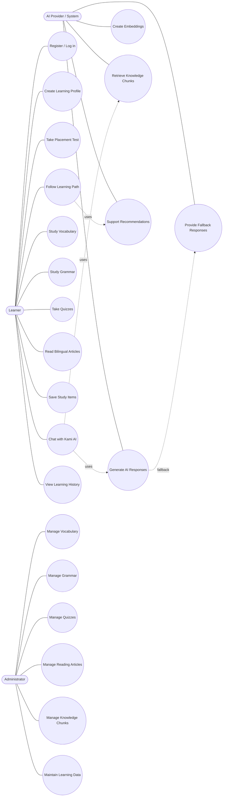

**Figure 3.1. Use-Case Diagram of Nihongo AI Study**

### 3.2.1.2. Specification of Use Cases

Create learning profile. The learner enters learning goals, kana level, daily study time, JLPT deadline, and preferred topics. The system validates the input, stores the learner profile, and uses it to initialize the personalized learning path.

Take placement test. The learner completes a short test based on the profile context. The system stores the result and uses it to estimate the learner's starting point, identify weak areas, and improve the next learning recommendations.

Follow learning path. The learner opens the learning path to view recommended learning tasks. The system uses learner profile, placement result, vocabulary progress, quiz attempts, and activity logs to rank the next learning actions.

Study vocabulary and grammar. The learner starts a focused learning session from the learning path or library. The system displays learning cards, records completion, updates progress, and writes activity logs for future recommendations.

Take quizzes. The learner answers multiple-choice questions and submits the quiz. The system calculates the score, stores the attempt, displays explanations, and uses the result to estimate mastery.

Chat with Kami AI. The learner asks a question about vocabulary, grammar, quiz, reading content, or learning direction. The system retrieves relevant knowledge chunks, builds a grounded prompt, calls the AI provider, and returns an answer with sources when available.

Read bilingual articles. The learner reads Japanese articles with Vietnamese support, furigana, audio, and reading questions. The learner can save useful vocabulary or grammar items for later review.

Manage learning content. The administrator manages vocabulary, grammar, quizzes, reading articles, and knowledge chunks. These data sources are used by the learning modules, chatbot RAG, and recommendation engine.

Use Case: Create Learning Profile

Description: The learner creates an initial profile so that the system can personalize the learning path.

Actors: Learner.

Main flow:
1. The learner selects a learning goal, kana level, daily study time, JLPT deadline, and preferred topics.
2. The system validates the submitted information.
3. The system stores the learner profile.
4. The system initializes the personalized learning path.
5. The system redirects the learner to the next recommended step.

Use Case: Take Placement Test

Description: The learner takes a short test so that the system can estimate the starting level and adjust recommendations.

Actors: Learner.

Main flow:
1. The learner starts the placement test after onboarding or from the learning path.
2. The system displays questions based on the learner profile and N5 scope.
3. The learner answers the questions and submits the test.
4. The system calculates the result and stores the placement record.
5. The system updates the learning path based on the result.

Use Case: Follow Learning Path

Description: The learner follows a personalized sequence of learning tasks instead of manually choosing random content.

Actors: Learner, AI Provider / System.

Main flow:
1. The learner opens the learning path page.
2. The system collects learner profile, placement result, progress, quiz attempts, and activity logs.
3. The recommendation engine ranks suitable learning actions.
4. The system displays the recommended tasks with reasons and estimated time.
5. The learner selects a task and continues to the corresponding learning session.

Use Case: Study Vocabulary and Grammar

Description: The learner studies focused vocabulary or grammar content through short learning sessions.

Actors: Learner.

Main flow:
1. The learner starts a vocabulary or grammar session from the learning path or library.
2. The system displays one learning card at a time with Japanese content, reading support, Vietnamese meaning, and examples.
3. The learner marks each item as remembered, not remembered, understood, or needing review.
4. The system updates learning progress after each response.
5. When the session is completed, the system records an activity log and updates future recommendations.

Use Case: Take Quiz

Description: The learner completes a quiz to check understanding and provide evidence for mastery estimation.

Actors: Learner.

Main flow:
1. The learner opens a quiz from the quiz page or learning path.
2. The system displays multiple-choice questions.
3. The learner selects answers and submits the quiz.
4. The system calculates the score and stores the quiz attempt.
5. The system displays explanations and uses the result to adjust recommendations.

Use Case: Chat with Kami AI

Description: The learner asks a natural-language question and receives a grounded answer based on internal learning data.

Actors: Learner, AI Provider / System.

Main flow:
1. The learner types a question about vocabulary, grammar, quiz, reading content, or learning direction.
2. The system retrieves relevant knowledge chunks from the database.
3. The system builds a prompt using the retrieved context and learner question.
4. The AI provider generates an answer.
5. The system returns the answer with cited sources when available.
6. If AI configuration or embedding data is unavailable, the system uses fallback behavior to keep the chatbot usable.

Use Case: Read Bilingual Articles

Description: The learner reads Japanese content with Vietnamese support and saves useful study items.

Actors: Learner.

Main flow:
1. The learner opens the reading page.
2. The system displays bilingual articles with level, category, furigana, and audio when available.
3. The learner reads the article and optionally answers reading questions.
4. The learner saves useful vocabulary or grammar items.
5. The system stores saved items and activity logs for later review.

Use Case: Manage Learning Content

Description: The administrator manages the learning content used across study modules, RAG, and recommendations.

Actors: Administrator.

Main flow:
1. The administrator opens the admin content management area.
2. The administrator creates, updates, or reviews vocabulary, grammar, quiz, reading, or knowledge chunk data.
3. The system validates and stores the updated content.
4. The updated content becomes available to learning modules, chatbot RAG, and recommendation logic.

### 3.2.1.3. Sequence Diagrams

Sequence diagrams describe how actors, user interfaces, APIs, domain modules, database, and external AI provider interact over time. In this project, the most important sequences are onboarding and placement, learning path recommendation, chatbot RAG, and quiz submission because these flows represent the core value of Nihongo AI Study.

#### 3.2.1.3.1. Onboarding and Placement Sequence

This sequence shows how the learner creates a learning profile and optionally completes a placement test. The result is used to initialize or adjust the personalized learning path.

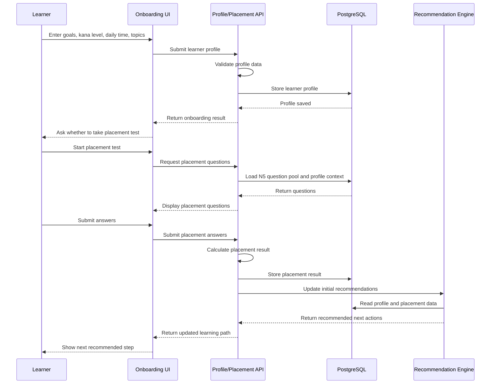

**Figure 3.2. Onboarding and Placement Sequence Diagram**

#### 3.2.1.3.2. Learning Path Recommendation Sequence

This sequence describes how the system generates personalized learning tasks from learner data. The recommendation engine reads profile, placement result, progress, quiz attempts, and activity logs before returning ranked actions.

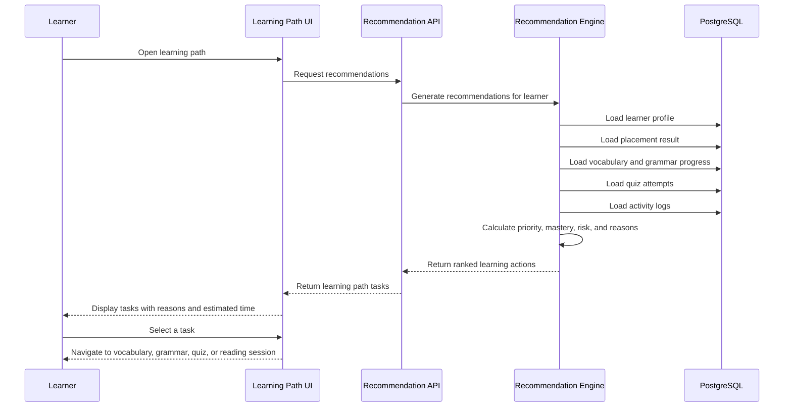

**Figure 3.3. Learning Path Recommendation Sequence Diagram**

#### 3.2.1.3.3. Chatbot RAG Sequence

This sequence represents the chatbot Kami flow. The system retrieves internal knowledge chunks before calling the AI provider so that the generated answer can be grounded in learning content.

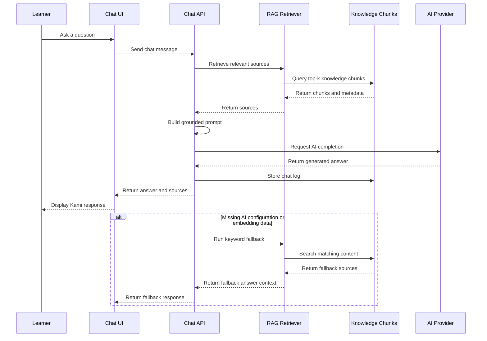

**Figure 3.4. Chatbot RAG Sequence Diagram**

#### 3.2.1.3.4. Quiz Submission Sequence

This sequence shows how a learner completes a quiz and how the result becomes evidence for future recommendations.

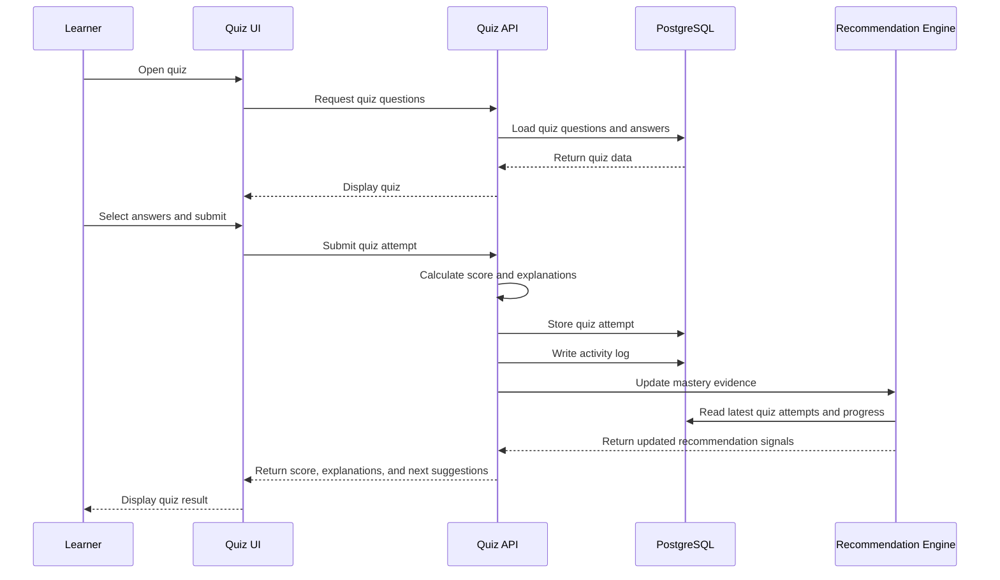

**Figure 3.5. Quiz Submission Sequence Diagram**

### 3.2.1.4. Activity Diagram

The activity diagram captures the personalized learning flow of Nihongo AI Study. After a learner creates a profile, the system checks whether a placement test is needed. If the learner takes the test, the system stores the result and uses it together with profile, progress, quiz attempts, and activity logs to generate recommendations. The learner then selects a task, completes a study session, and the system updates progress for future recommendations. If profile data or placement data is missing, the system redirects the learner to complete the required step before continuing.

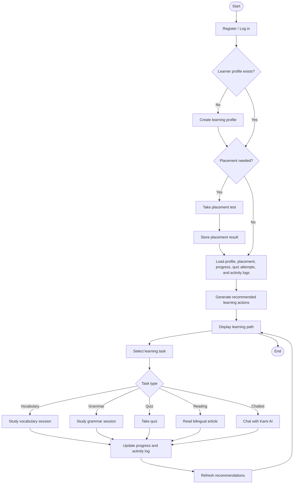

**Figure 3.6. Activity Diagram of the Personalized Learning Flow**

### 3.2.2. Kiến trúc tổng thể

Hệ thống được xây dựng theo kiến trúc web application nhiều lớp, sử dụng Next.js App Router làm nền tảng chính. Frontend hiển thị giao diện học tập và gọi API nội bộ. API layer xử lý nghiệp vụ, truy xuất dữ liệu qua Prisma, gọi các module RAG/recommendation và tích hợp AI provider khi cần. PostgreSQL đóng vai trò lưu trữ dữ liệu người dùng, học liệu, tiến độ, activity log, lịch sử chatbot và knowledge chunks.

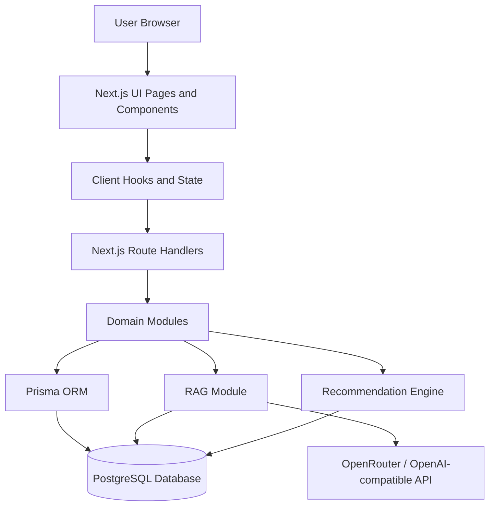

**Figure 3.7. System Architecture of Nihongo AI Study**

Các lớp chính của hệ thống:

| Lớp | Thành phần | Vai trò |
|---|---|---|
| Presentation layer | `app/(app)`, `components/app`, `components/ui` | Hiển thị giao diện học tập và tương tác người dùng |
| Application layer | React hooks, client state | Quản lý trạng thái, gọi API, đồng bộ dữ liệu màn hình |
| API layer | `app/api/*` | Xử lý request, xác thực, gọi domain modules |
| Domain layer | `lib/rag`, `lib/recommendation`, `lib/onboarding`, `lib/vocabulary`, `lib/grammar` | Xử lý nghiệp vụ học tập, RAG và recommendation |
| Data layer | Prisma, PostgreSQL | Lưu dữ liệu người dùng, học liệu, tiến độ và tri thức |
| External AI layer | OpenRouter/OpenAI-compatible API | Sinh câu trả lời chatbot và embedding khi có cấu hình |

### 3.2.3. API Architecture

API được tổ chức bằng Next.js Route Handlers. Mỗi nhóm chức năng có route riêng để dễ bảo trì và mở rộng. Các API chính bao gồm xác thực, learner profile, placement test, vocabulary, grammar, quiz, reading, chatbot, recommendation, activity log và admin content management.

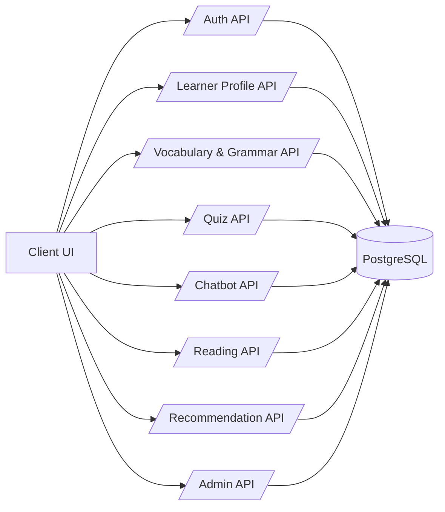

**Figure 3.8. API Architecture**

Thiết kế API ưu tiên tính module hóa. Các route liên quan đến học tập không xử lý trực tiếp toàn bộ logic phức tạp trong handler mà gọi sang domain modules. Cách làm này giúp mã nguồn dễ kiểm thử, dễ thay đổi thuật toán recommendation hoặc RAG mà không ảnh hưởng trực tiếp đến UI.

### 3.2.4. Cloud Deployment Orientation

Trong phạm vi MVP, hệ thống có thể chạy ở môi trường local để phát triển và demo. Khi triển khai thực tế, kiến trúc có thể đưa lên nền tảng hỗ trợ Next.js như Vercel hoặc server Node.js, kết hợp PostgreSQL cloud database và biến môi trường cho AI API.

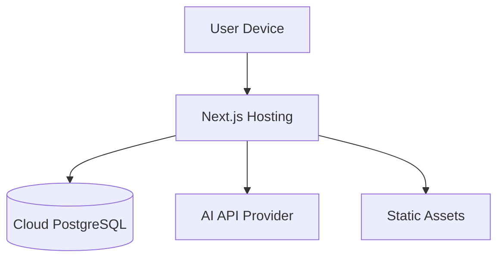

**Figure 3.9. Cloud Deployment Orientation**

Nếu phát triển thành sản phẩm thương mại, hệ thống cần bổ sung logging, monitoring, backup dữ liệu, giới hạn lượt gọi AI, cơ chế thanh toán/subscription và tối ưu chi phí API.

## 3.5. Database Design

Database schema design defines the main entities, their key properties, and the relationships required to support learning progress, RAG chatbot, recommendation, reading, and administration features. Unlike the reference system that uses a Knowledge Graph, Nihongo AI Study uses PostgreSQL as the primary relational database and Prisma as the ORM. Therefore, the schema is designed as a relational data model with learning entities, progress entities, activity entities, and AI/RAG entities.

### 3.5.1. Entity Types

The database defines the main entity types representing users, learning content, progress tracking, chatbot history, reading data, and knowledge sources for RAG.

| Entity | Description and key properties |
|---|---|
| `User` | User account and role information: email, password hash, role, created time |
| `AuthSession` | Login session data used to maintain authentication state |
| `LearnerProfile` | Learner goals, kana level, daily study time, JLPT target, preferred topics, cold-start metadata |
| `PlacementResult` | Placement test result, score, estimated starting level, weak areas, created time |
| `Vocabulary` | Japanese word, kana, romaji, Vietnamese meaning, example sentence, topic, level |
| `Grammar` | Grammar pattern, structure, meaning, explanation, examples, level |
| `QuizQuestion` | Quiz content, question type, level, related vocabulary/grammar, explanation |
| `QuizAnswer` | Answer options, correctness flag, explanation or feedback |
| `QuizAttempt` | Learner quiz submission, score, answers, completion time |
| `UserVocabularyProgress` | Per-learner vocabulary progress: learned state, review state, timestamps |
| `ActivityLog` | Learning event stream used by history and recommendation: activity type, metadata, timestamp |
| `ChatConversation` | Chat session between learner and Kami AI |
| `ChatConversationMessage` | Individual chat messages, role, content, sources, timestamp |
| `SavedStudyItem` | Vocabulary, grammar, article, or study item saved by the learner for later review |
| `NewsArticle` | Reading article data: title, source URL, level, category, text, furigana, audio, questions |
| `KnowledgeChunk` | RAG knowledge source: content chunk, source type, metadata, embedding |

**Table 3.2. Entity Types of the Database Schema**

### 3.5.2. Relationship Types

The relationships connect user data, learning content, progress records, chatbot history, and RAG knowledge sources. These relationships allow the system to personalize learning tasks and retrieve relevant information for AI responses.

| Relationship | Meaning |
|---|---|
| `User` - `AuthSession` | A user can have multiple login sessions |
| `User` - `LearnerProfile` | A user owns one learner profile used for personalization |
| `User` - `PlacementResult` | A user can take placement tests and store results |
| `User` - `QuizAttempt` | A user can submit multiple quiz attempts |
| `User` - `ActivityLog` | A user generates learning activity events |
| `User` - `SavedStudyItem` | A user can save vocabulary, grammar, or reading items |
| `User` - `ChatConversation` | A user can have multiple chat conversations |
| `ChatConversation` - `ChatConversationMessage` | A conversation contains many messages |
| `Vocabulary` - `UserVocabularyProgress` | Vocabulary progress is tracked per learner |
| `QuizQuestion` - `QuizAnswer` | A quiz question has multiple answer options |
| `NewsArticle` - `SavedStudyItem` | A learner may save study items from reading content |
| `KnowledgeChunk` - learning content | A knowledge chunk may reference vocabulary, grammar, quiz, or article data for RAG |
| `ActivityLog` - `RecommendationEngine` | Activity logs provide evidence for future recommendations |

**Table 3.3. Relationship Types of the Database Schema**

### 3.5.3. Conceptual ERD

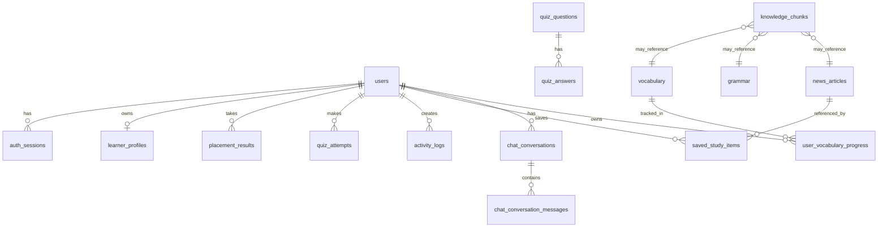

**Figure 3.10. Conceptual ERD**

Figure 3.10 illustrates the conceptual ERD of the system. The central entity is `users`, which connects to learner profiles, placement results, quiz attempts, activity logs, saved items, and chat conversations. Learning content is represented by vocabulary, grammar, quiz, and reading article entities. AI-related knowledge is represented by `knowledge_chunks`, which can reference learning content and provide source material for the RAG chatbot.

This schema prioritizes extensibility. For example, `activity_logs` are not only used for displaying learning history but also serve as evidence for the recommendation engine. `knowledge_chunks` are not only used by the chatbot but can later support semantic search, content discovery, and personalized explanation. If the product scales, the schema can be extended with subscription tables, teacher/classroom entities, full SM-2 review scheduling, and more detailed mastery tracking by topic.

## 3.6. Security and Authentication Design

Security is enforced through a session-based authentication mechanism. When a user logs in successfully, the system creates a secure session token, stores only the hashed version of that token in the `auth_sessions` table, and sends the raw token to the browser through an httpOnly cookie. Because the cookie is httpOnly, client-side JavaScript cannot read it directly, reducing the risk of token theft through cross-site scripting attacks.

Passwords are never stored in plain text. During registration, the password is hashed before being saved to the `users` table. In the current implementation, the system uses Node.js `scrypt` with a per-password salt to derive the password hash. During login, the submitted password is hashed using the same salt and compared against the stored hash. This design protects user credentials even if the database is exposed.

Every protected request is associated with the current authenticated session. The backend reads the session cookie, hashes the token, looks up the matching record in `auth_sessions`, checks the expiration time, and loads the corresponding user. If the session is missing, expired, or invalid, the system treats the request as unauthenticated. Expired sessions can be removed from the database to reduce stale authentication records.

Role-based authorization is used to separate learner and administrator capabilities. Ordinary learners can access learning features such as onboarding, placement test, learning path, vocabulary, grammar, quiz, reading, chatbot, saved items, and history. Administrative features are restricted to users with the `admin` role, preventing learners from managing learning content, quiz data, reading articles, or knowledge chunks used by the RAG module.

This security design is appropriate for the MVP because it is simpler than a full OAuth/JWT architecture while still providing practical protection for user accounts, learning progress, and administrative operations. If the product becomes commercial, the security layer can be extended with rate limiting, CSRF protection, email verification, password reset, audit logging, stricter admin permissions, and payment-related security controls.

## 3.7. 

The system exposes API endpoints through Next.js Route Handlers. These endpoints support authentication, learner profile management, placement testing, learning content retrieval, quiz submission, reading data, RAG chatbot, recommendation generation, activity logging, and admin content management. Representative endpoints are listed below.

| Method | Endpoint | Description |
|---|---|---|
| POST | `/api/auth/login` | Authenticate a user and create a login session |
| POST | `/api/auth/register` | Register a new learner account |
| GET | `/api/learner-profile` | Retrieve the current learner profile |
| POST | `/api/learner-profile` | Create or update learner profile data |
| GET | `/api/placement-test` | Get placement test questions based on learner context |
| POST | `/api/placement-test` | Submit placement answers and store the result |
| GET | `/api/recommendations` | Return personalized learning recommendations |
| GET | `/api/vocabulary` | List vocabulary items for study or review |
| GET | `/api/grammar` | List grammar patterns for study or review |
| POST | `/api/quiz/attempts` | Submit quiz answers and store quiz attempt data |
| GET | `/api/reading` | List bilingual reading articles |
| POST | `/api/saved-items` | Save vocabulary, grammar, or reading items for later review |
| POST | `/api/chat` | Ask Kami AI using RAG and return an answer with sources when available |
| GET | `/api/activity-log` | Retrieve learner activity history |
| POST | `/api/activity-log` | Record learning activity events |
| GET | `/api/admin/*` | Retrieve admin-managed content and system data |
| POST | `/api/admin/*` | Create or update vocabulary, grammar, quiz, reading, or knowledge data |

**Table 3.4. Representative API Endpoints**

The API follows REST-oriented conventions where resource-based paths represent application data and HTTP methods describe the intended operation. Read operations such as retrieving vocabulary, grammar, reading articles, learner profile, activity logs, and recommendations are exposed mainly as `GET` endpoints. State-changing operations such as login, registration, profile creation, placement submission, quiz submission, saved item creation, chat requests, and admin content updates use `POST`.

Authentication-related APIs maintain user sessions and protect learner-specific resources. Learner endpoints require an authenticated user so that profile, progress, quiz attempts, saved items, chat history, and activity logs are scoped to the current account. Administrative endpoints are protected by role checks so that only administrators can manage learning content, quiz data, reading articles, and knowledge chunks used by the RAG module.

The chatbot endpoint is designed differently from simple content retrieval endpoints because it coordinates several internal steps. When the learner sends a message to `/api/chat`, the backend retrieves relevant `knowledge_chunks`, builds a grounded prompt, calls the OpenRouter/OpenAI-compatible provider, stores the conversation data, and returns the answer with sources when available. If AI configuration or embedding data is missing, the endpoint can fall back to keyword-based retrieval to keep the chatbot usable during MVP demonstration.

This API design is suitable for the MVP because it keeps all backend behavior inside the same Next.js application while preserving clear module boundaries. If the product scales, selected API groups can be separated into independent services, such as an AI/RAG service, recommendation service, content management service, or learning analytics service.

## 3.8. Data-Flow Design

The end-to-end data flow of Nihongo AI Study connects learner actions, backend APIs, PostgreSQL storage, recommendation logic, and AI/RAG processing. When a learner registers or logs in, the authentication API validates credentials, creates a secure session, stores the hashed session token in `auth_sessions`, and returns an httpOnly cookie to the browser. After onboarding, the learner profile is stored in PostgreSQL and becomes one of the main inputs for personalization.

For the learning flow, profile data, placement results, vocabulary progress, quiz attempts, saved items, and activity logs are persisted in PostgreSQL. When the learner opens the dashboard or learning path, the backend loads these records and passes them to the recommendation engine. The recommendation engine ranks suitable actions such as studying vocabulary, learning grammar, reviewing weak items, taking quizzes, or reading bilingual articles. The selected task is then displayed to the learner through the Next.js UI.

For the study-session flow, learner actions are sent from the frontend to the corresponding API or client-side progress handler. Vocabulary and grammar sessions update progress states and write activity logs. Quiz submissions are scored, stored as `quiz_attempts`, and reused as evidence for mastery estimation. Reading interactions can create `saved_study_items`, which help the learner review useful vocabulary or grammar later.

For the chatbot flow, the learner sends a message to the chat API. The backend retrieves relevant `knowledge_chunks` from PostgreSQL, builds a grounded prompt, calls the OpenRouter/OpenAI-compatible provider, and returns the answer with sources when available. Chat conversations and messages are stored so the learner can continue or review previous interactions. If embedding data or AI configuration is unavailable, the system falls back to keyword-based retrieval to keep the MVP usable.

Unlike systems that separate relational, graph, and vector workloads into different databases, this MVP uses PostgreSQL as the central data store for relational learning data and RAG knowledge chunks. This keeps deployment simple while still supporting the core product value. In future versions, the RAG data flow can be extended with pgvector or a dedicated vector database, and the analytics/recommendation flow can be separated into an independent learning analytics service.

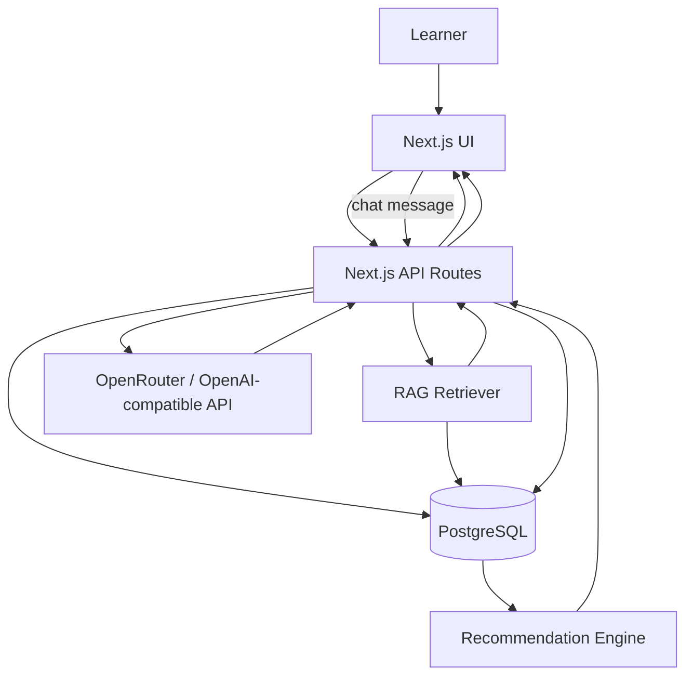

**Figure 3.14. Data-Flow Design of Nihongo AI Study**

## 3.9. Thiết kế chức năng học tập

### 3.9.1. Onboarding và Placement Test

Onboarding được thiết kế như bước tạo lộ trình học thay vì chỉ là form thu thập thông tin. Người học nhập mục tiêu, trình độ kana, thời gian học mỗi ngày, deadline JLPT và chủ đề quan tâm. Từ các thông tin này, hệ thống tạo learner profile và metadata ban đầu để cá nhân hóa trải nghiệm.

Placement test giúp xác định điểm bắt đầu tương đối. Nếu người học không chắc trình độ hoặc muốn ôn lại kiến thức cũ, hệ thống điều hướng sang bài kiểm tra đầu vào. Kết quả placement được lưu lại và sử dụng trong learning path cũng như recommendation engine.

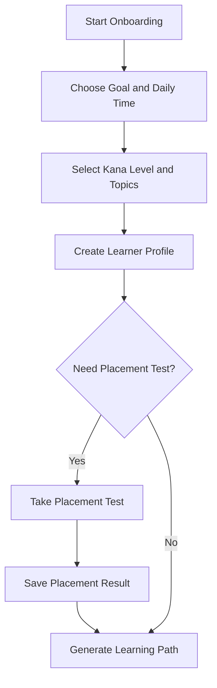

**Figure 3.11. Onboarding and Placement Flow**

### 3.9.2. Learning Path

Learning path là trung tâm điều phối học tập. Mỗi task có loại nội dung, tiêu đề, thời lượng ước tính, trạng thái và CTA. Task từ vựng mở phiên học từ vựng; task ngữ pháp mở phiên học ngữ pháp; quiz mở bài kiểm tra; review mở nội dung cần ôn. Khi người học hoàn thành task, hệ thống ghi activity log để cập nhật lịch sử và tránh gợi ý lặp lại không cần thiết.

### 3.9.3. Vocabulary Session

Route `/vocabulary` đóng vai trò kho từ vựng, trong khi `/vocabulary/session/[sessionId]` là phiên học có mục tiêu. Mỗi phiên học hiển thị flashcard một từ tại một thời điểm, gồm tiếng Nhật, kana/romaji, nghĩa tiếng Việt, ví dụ Nhật và dịch nghĩa. Người học chọn `Đã nhớ` hoặc `Chưa nhớ`; hệ thống cập nhật tiến độ và chuyển sang từ tiếp theo.

### 3.9.4. Grammar Session

Route `/grammar` là thư viện ngữ pháp, còn `/grammar/session/[sessionId]` là phiên học ngữ pháp theo mục tiêu. Card ngữ pháp hiển thị pattern, cấu trúc, ý nghĩa, ví dụ Nhật - Việt và mini check `Đã hiểu`/`Cần ôn`. Khi hoàn thành, hệ thống ghi activity `grammar_session` để phục vụ learning path, history và recommendation.

### 3.9.5. Quiz

Quiz cho phép người học trả lời câu hỏi trắc nghiệm, nộp bài, nhận điểm và xem giải thích. Kết quả được lưu vào `quiz_attempts`, đồng thời ảnh hưởng đến mastery estimate trong recommendation engine. Đây là dữ liệu quan trọng để hệ thống phát hiện người học đang yếu phần nào và đề xuất hành động củng cố.

### 3.9.6. Reading/TODAII

Module reading hỗ trợ bài đọc song ngữ, furigana, audio, câu hỏi đọc hiểu và lưu mục học. Dữ liệu bài đọc có thể được import từ nguồn TODAII thông qua crawler/extension trong phạm vi project. Màn reading cho phép tìm kiếm, lọc level/category, bật furigana và lưu từ/ngữ pháp để học lại sau.

## 3.10. Thiết kế Chatbot RAG và Recommendation Engine

Chatbot Kami được thiết kế để hỗ trợ người học đặt câu hỏi về từ vựng, ngữ pháp, quiz, bài đọc hoặc lộ trình học. Điểm quan trọng là chatbot không chỉ trả lời bằng kiến thức tổng quát của AI mà còn truy xuất tri thức nội bộ từ `knowledge_chunks`.

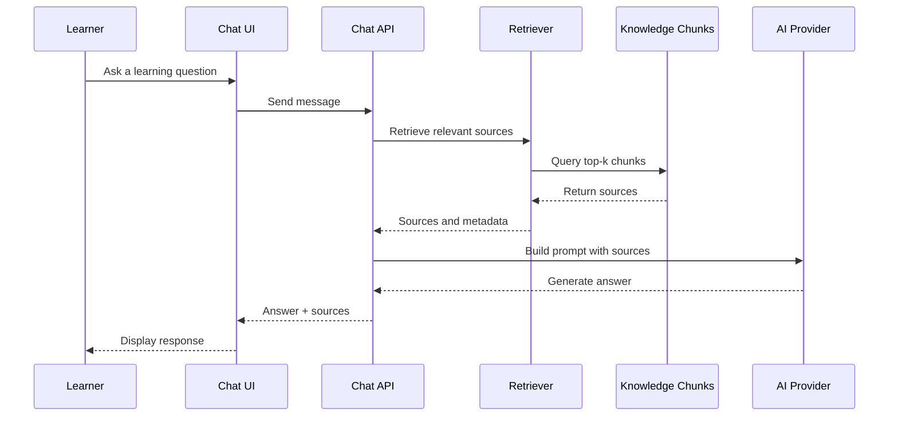

**Figure 3.12. RAG Chatbot Flow**

Nguồn tri thức của RAG gồm vocabulary, grammar, quiz và bài đọc. Hệ thống có hai cơ chế truy xuất:

- Vector retrieval nếu `knowledge_chunks` có embedding.
- Keyword fallback khi thiếu API key, thiếu embedding hoặc cần đảm bảo demo không gián đoạn.

Ngoài trả lời câu hỏi, chatbot có thể khai thác hồ sơ học, tiến độ, placement, saved items và bài đọc để đưa ra phản hồi sát ngữ cảnh hơn. Đây là điểm giúp Kami gần với vai trò AI tutor thay vì chỉ là chatbot hỏi đáp chung.

### 3.10.1. Recommendation Engine

Recommendation engine nhận dữ liệu từ learner profile, placement result, vocabulary progress, quiz attempts và activity log để đề xuất hành động học tập tiếp theo. Đầu ra recommendation không chỉ gồm tiêu đề task mà còn có reason, priority, target URL, estimated time, expected outcome và evidence.

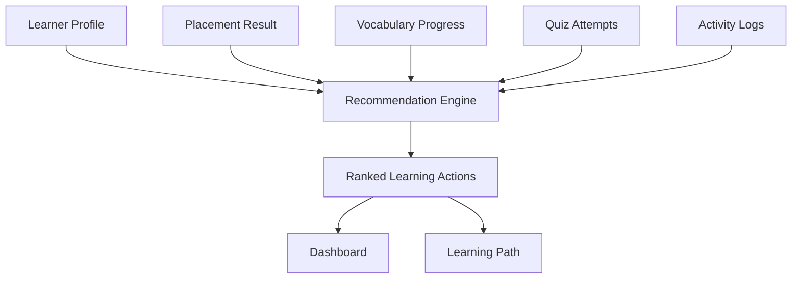

**Figure 3.13. Recommendation Flow**

Các rule chính trong MVP:

- Người dùng chưa onboarding: ưu tiên tạo hồ sơ học.
- Có hồ sơ nhưng chưa placement: ưu tiên kiểm tra đầu vào.
- Placement yếu kana: gợi ý học từ vựng/kana nền tảng.
- Có từ cần ôn: gợi ý review.
- Quiz mastery thấp: gợi ý quiz củng cố.
- Còn từ/ngữ pháp chưa học: gợi ý phiên học tiếp theo.
- Lâu không có hoạt động: gợi ý phiên học ngắn.
- Nếu topic/pattern đã hoàn thành hôm nay: hạn chế gợi ý lại cùng nội dung.

Recommendation engine được thiết kế theo hướng explainable AI ở mức MVP. Người học không chỉ thấy “nên học gì” mà còn thấy “vì sao nên học”, ví dụ do điểm quiz thấp, do lâu chưa ôn hoặc do placement test cho thấy cần củng cố kiến thức nền.

## 3.11. Mô tả các công nghệ sử dụng

Các công nghệ được lựa chọn theo tiêu chí phù hợp với MVP, dễ triển khai, có cộng đồng lớn và có khả năng mở rộng khi sản phẩm phát triển thành dịch vụ thương mại. Next.js giúp gom frontend và backend trong cùng một codebase; Prisma/PostgreSQL phù hợp với dữ liệu học tập có quan hệ rõ ràng; RAG và AI API giúp sản phẩm có điểm đổi mới mà không cần tự huấn luyện mô hình ngôn ngữ lớn.

| Nhóm | Công nghệ | Lý do sử dụng |
|---|---|---|
| Frontend | Next.js 16, React 19, TypeScript | Xây dựng web app hiện đại, hỗ trợ App Router, component hóa và type safety |
| UI | Tailwind CSS, shadcn/ui, Radix UI, Lucide icons, Recharts | Tạo giao diện nhất quán, dễ mở rộng, có biểu đồ và component tương tác |
| Backend | Next.js Route Handlers | Tích hợp API trong cùng codebase, phù hợp MVP và giảm độ phức tạp triển khai |
| Database | PostgreSQL | Lưu dữ liệu người dùng, học liệu, tiến độ, activity log, chat history và knowledge chunks |
| ORM | Prisma 7 | Quản lý schema, migration và truy vấn dữ liệu rõ ràng |
| AI/RAG | OpenRouter/OpenAI-compatible API, embedding, top-k retrieval | Tích hợp chatbot AI, truy xuất tri thức nội bộ và trả lời có nguồn |
| Recommendation | Rule-based XAI, BKT-inspired scoring, SM-2-inspired review priority | Tạo gợi ý học tập có giải thích trong điều kiện dữ liệu người dùng còn ít |
| Validation | Zod | Kiểm tra dữ liệu đầu vào cho form và API |
| Testing | Playwright, TypeScript typecheck, Next build | Kiểm thử luồng chính, đảm bảo type safety và khả năng build production |
| Tooling | pnpm, tsx, Prisma migrate/seed | Quản lý package, chạy script dữ liệu, migration và seed/import dữ liệu |

## 3.12. Thiết kế UI/UX

Giao diện được thiết kế theo hướng thân thiện với người học tiếng Nhật sơ cấp, ưu tiên sự rõ ràng và giảm tải nhận thức. Người học mới không cần hiểu thuật toán bên dưới; họ chỉ cần thấy mục tiêu, task tiếp theo, tiến độ và phản hồi sau mỗi hoạt động học.

Các màn hình chính gồm landing, dashboard, onboarding, placement test, learning path, vocabulary library, vocabulary session, grammar library, grammar session, quiz, chatbot, reading, history, profile và admin. Giao diện sử dụng phong cách giấy Nhật, màu nhẹ, card học tập, icon trực quan và nội dung song ngữ Nhật - Việt.

Nguyên tắc UI/UX:

- Dashboard phải hiển thị tổng quan tiến độ và đề xuất học tiếp theo.
- Learning path phải biến recommendation thành task cụ thể.
- Library và learning session phải tách riêng để tránh người học bị lạc trong kho nội dung.
- Phiên học phải ngắn, có trạng thái hoàn thành và phản hồi rõ ràng.
- Chatbot phải hiển thị câu trả lời dễ đọc và nguồn tham khảo khi có.
- Reading cần hỗ trợ furigana, audio và lưu mục học để kết nối với quá trình ôn tập.

## 3.13. Xây dựng MVP

### 3.13.1. Chức năng cốt lõi của MVP

MVP của Nihongo AI Study bao gồm các chức năng cốt lõi sau:

| Nhóm | Chức năng |
|---|---|
| Account | Đăng ký, đăng nhập, duy trì phiên |
| Onboarding | Tạo hồ sơ học, chọn mục tiêu, kana level, thời gian học |
| Placement | Kiểm tra đầu vào và lưu kết quả |
| Learning path | Hiển thị task học cá nhân hóa |
| Vocabulary | Kho từ và phiên học flashcard |
| Grammar | Thư viện ngữ pháp và phiên học pattern |
| Quiz | Làm quiz, nộp bài, xem điểm và giải thích |
| Chatbot | Kami AI sử dụng RAG và nguồn tham khảo |
| Reading | Bài đọc song ngữ, furigana, audio, saved items |
| History/Profile | Lịch sử học tập và hồ sơ cá nhân |
| Admin | Quản trị nội dung học tập |

### 3.13.2. Giá trị nổi bật của MVP

Giá trị nổi bật của MVP nằm ở việc kết hợp ba lớp: nội dung học N5 song ngữ, AI có căn cứ dữ liệu và recommendation có giải thích. Thay vì chỉ cung cấp danh sách bài học, hệ thống tạo ra một trải nghiệm học có định hướng: người học được kiểm tra đầu vào, nhận lộ trình, học theo phiên ngắn, hỏi chatbot khi gặp khó khăn và nhận gợi ý học tiếp theo.

Về mặt đổi mới sáng tạo, MVP chứng minh khả năng phát triển sản phẩm giáo dục số có AI tutor và cá nhân hóa dựa trên dữ liệu. Về mặt thương mại hóa, cấu trúc chức năng hiện tại có thể mở rộng thành mô hình freemium/Premium, trong đó AI tutor nâng cao, luyện JLPT, báo cáo học tập và dashboard giáo viên là các tính năng có khả năng tạo dòng tiền.

### 3.13.3. Phiên bản thử nghiệm và khả năng mở rộng

Phiên bản thử nghiệm hiện ưu tiên kiểm chứng luồng học chính và khả năng tích hợp công nghệ. Các chức năng như thanh toán, subscription, dashboard giáo viên hoàn chỉnh, mobile native, speech practice và ML recommendation chưa nằm trong phạm vi MVP. Tuy nhiên, kiến trúc dữ liệu và module đã được thiết kế để có thể mở rộng theo các hướng này.

Lộ trình mở rộng gồm:

- Mở rộng dữ liệu từ N5 lên N4-N1.
- Bổ sung spaced repetition đầy đủ với interval/easiness.
- Tối ưu RAG bằng pgvector, reranking hoặc vector database.
- Thêm luyện nghe - nói và chấm phát âm.
- Bổ sung gói Premium cá nhân và gói lớp học/trung tâm.
- Phát triển dashboard giáo viên, báo cáo tiến độ và quản lý nhóm học viên.

---

# Chương 4. Triển khai và mô hình kinh doanh

## 4.1. Kết quả triển khai

Sản phẩm đã được triển khai ở mức MVP dưới dạng ứng dụng web Next.js, sử dụng PostgreSQL/Prisma cho dữ liệu học tập và tích hợp AI thông qua OpenRouter/OpenAI-compatible API. Mục tiêu của phiên bản này là chứng minh các luồng học cốt lõi hoạt động được: người học tạo hồ sơ, làm kiểm tra đầu vào, nhận lộ trình, học theo phiên, làm quiz, đọc bài song ngữ và hỏi chatbot Kami.

The MVP was deployed as a web application backed by PostgreSQL, Prisma, and AI/RAG modules. This section presents the deployed interface of each functional module. The placeholder frames below are reserved for the corresponding live screenshots from the running system.

### 4.1.1. Login and Registration Pages

The application provides login and registration interfaces for managing learner access. Users authenticate with email and password, while new users can create an account through the registration page. After successful authentication, the system creates a secure session using an httpOnly cookie and redirects the user to the learner dashboard or admin page depending on the account role.

**Figure 4.1. Login page of Nihongo AI Study**

**Figure 4.2. Registration page of Nihongo AI Study**

### 4.1.2. Dashboard Page

The dashboard acts as the learner's starting point after login. It summarizes learning progress, recent activity, and recommended next actions. The purpose of this screen is to reduce decision-making effort: instead of manually searching for content, the learner can immediately continue with the most relevant task suggested by the system.

**Figure 4.3. Learner dashboard with progress and recommendations**

### 4.1.3. Onboarding and Placement Test Pages

The onboarding page collects the learner's goal, kana level, daily study time, JLPT target, and preferred topics. This information initializes the learner profile and provides context for recommendation. The placement test page then estimates the learner's starting point and identifies weak areas. Together, these screens form the cold-start personalization flow of the system.

**Figure 4.4. Onboarding page for learner profile creation**

**Figure 4.5. Placement test page**

### 4.1.4. Learning Path Page

The learning path page displays personalized tasks such as vocabulary sessions, grammar sessions, quizzes, reviews, or reading activities. Each task includes a title, estimated time, status, and call-to-action. This page is the main bridge between recommendation logic and actual learning behavior, because algorithmic suggestions are converted into concrete actions.

**Figure 4.6. Personalized learning path page**

### 4.1.5. Vocabulary and Grammar Session Pages

Vocabulary and grammar sessions are designed as short focused learning flows. The vocabulary session displays flashcards with Japanese text, kana/romaji, Vietnamese meaning, examples, and remembered/not remembered actions. The grammar session presents pattern, structure, meaning, examples, and understood/needs-review actions. After completion, the system updates progress and writes activity logs for future recommendations.

**Figure 4.7. Vocabulary learning session**

**Figure 4.8. Grammar learning session**

### 4.1.6. Quiz Page

The quiz page allows learners to answer multiple-choice questions, submit their responses, and view the result with explanations. Quiz attempts are stored in the database and reused by the recommendation engine as evidence for mastery estimation. This turns assessment data into personalized learning signals.

**Figure 4.9. Quiz page with answer submission and result**

### 4.1.7. Kami AI Chatbot Page

The chatbot page provides access to Kami AI, an AI tutor that answers questions about vocabulary, grammar, quiz, reading content, and learning direction. The chatbot uses RAG to retrieve relevant `knowledge_chunks` before generating a response, and it can show sources when available. This feature is one of the main innovation points of the MVP.

**Figure 4.10. Kami AI chatbot with RAG-based response**

### 4.1.8. Reading and Saved Items Pages

The reading module displays bilingual Japanese articles with furigana, audio support, comprehension questions, and saved study items. Learners can save useful vocabulary or grammar items while reading, allowing reading activity to connect with later review and recommendation.

**Figure 4.11. Bilingual reading page with furigana support**

### 4.1.9. Admin Page

The admin page supports learning content management. Administrators can maintain vocabulary, grammar, quiz, reading, and knowledge data used by the learning modules, RAG chatbot, and recommendation engine. This ensures that the system can grow beyond static seed data as the product develops.

**Figure 4.12. Admin content management page**

### 4.1.1. Demo chức năng chính

Luồng demo đề xuất cho hệ thống:

1. Người học đăng ký hoặc đăng nhập vào hệ thống.
2. Người học tạo hồ sơ học trong onboarding, chọn mục tiêu học N5 và thời gian học mỗi ngày.
3. Người học làm placement test để hệ thống xác định điểm bắt đầu.
4. Learning path hiển thị các task học được cá nhân hóa.
5. Người học hoàn thành một phiên từ vựng hoặc ngữ pháp.
6. Người học làm quiz để kiểm tra mức độ hiểu.
7. Người học hỏi Kami AI về một từ vựng/ngữ pháp và nhận câu trả lời dựa trên RAG.
8. Người học đọc bài song ngữ, bật furigana và lưu mục học cần ôn.

Các ảnh giao diện có thể được chèn khi dàn trang Word:

| Hình | Nội dung đề xuất |
|---|---|
| Figure 4.1 | Onboarding screen for learning profile creation |
| Figure 4.2 | Placement test screen |
| Figure 4.3 | Personalized learning path screen |
| Figure 4.4 | Vocabulary or grammar session screen |
| Figure 4.5 | Quiz result screen |
| Figure 4.6 | Kami AI chatbot with RAG sources |
| Figure 4.7 | Bilingual reading screen with furigana |

### 4.1.2. Case study sử dụng

Case study minh họa một người học mới chuẩn bị JLPT N5. Ban đầu, người học chưa chắc trình độ kana và không biết nên bắt đầu từ từ vựng, ngữ pháp hay quiz. Sau khi onboarding, hệ thống ghi nhận mục tiêu học N5, thời gian học mỗi ngày và chủ đề quan tâm. Placement test giúp hệ thống xác định người học cần củng cố nền tảng. Learning path sau đó đề xuất một phiên từ vựng ngắn, một mẫu ngữ pháp cơ bản và một quiz kiểm tra.

Khi người học hoàn thành phiên học, activity log được ghi lại. Nếu quiz cho thấy điểm thấp, recommendation engine ưu tiên task củng cố thay vì đẩy người học sang nội dung mới. Khi người học hỏi Kami AI, chatbot truy xuất `knowledge_chunks` liên quan và trả lời dựa trên nguồn tri thức nội bộ. Case study này thể hiện giá trị chính của sản phẩm: biến dữ liệu học tập thành hành động học cụ thể.

## 4.2. Thử nghiệm và đánh giá

Các bước kiểm thử tập trung vào khả năng build, type safety và các luồng e2e quan trọng. Kết quả gần nhất:

| Hạng mục | Lệnh kiểm thử | Kết quả |
|---|---|---|
| TypeScript typecheck | `npx tsc --noEmit` | Pass |
| Production build | `pnpm.cmd build` | Pass |
| Playwright e2e | `pnpm.cmd test:e2e` | Pass 6/6 |

**Table 4.2. Technical Testing Results**

Các flow e2e đã kiểm tra:

- Landing và login.
- Các trang học chính sau đăng nhập.
- Quiz có thể trả lời và nộp bài.
- Chatbot trả lời có source hoặc fallback.
- Kami có thể tạo quiz chẩn đoán.
- Reading render ổn kể cả khi dữ liệu bài đọc rỗng.

Trong phạm vi khóa luận, phản hồi người dùng thật chưa được thu thập ở quy mô lớn. Vì vậy, đánh giá hiện tại chủ yếu là đánh giá kỹ thuật và đánh giá tính hoàn chỉnh của MVP. Ở giai đoạn tiếp theo, sản phẩm cần thử nghiệm với nhóm sinh viên hoặc người học N5 để đo mức độ dễ sử dụng, tỷ lệ hoàn thành phiên học, tần suất quay lại, mức cải thiện điểm quiz và mức độ hài lòng với chatbot AI.

## 4.3. Phân tích hiệu quả

Về tiết kiệm thời gian, onboarding và placement test giúp người học giảm thời gian tự xác định điểm bắt đầu. Thay vì phải tự duyệt qua nhiều tài liệu, người học nhận được learning path và task tiếp theo ngay trong hệ thống. Recommendation engine cũng giúp giảm thời gian ra quyết định bằng cách chuyển dữ liệu hồ sơ, quiz và activity log thành gợi ý học cụ thể.

Về tăng hiệu suất học, phiên học ngắn giúp người học tập trung vào một nhóm nội dung nhỏ như từ vựng, ngữ pháp hoặc quiz. Activity log và quiz attempts tạo dữ liệu phản hồi để hệ thống ưu tiên ôn tập hoặc củng cố nội dung yếu. Chatbot Kami hỗ trợ giải thích tức thời bằng tiếng Việt, giúp người học không phải rời ứng dụng để tìm kiếm giải thích rời rạc.

Về giảm chi phí, sản phẩm có thể hỗ trợ người học tự học ngoài giờ với chi phí thấp hơn so với việc phụ thuộc hoàn toàn vào gia sư cá nhân. Với trung tâm hoặc lớp học nhỏ, dashboard và báo cáo tiến độ trong tương lai có thể giảm thời gian giáo viên theo dõi thủ công. Tuy nhiên, hệ thống cũng phát sinh chi phí API AI, hosting và dữ liệu, do đó cần cơ chế freemium/Premium, giới hạn lượt dùng AI và cache/fallback để kiểm soát chi phí vận hành.

Về độ chính xác và độ tin cậy, RAG giúp chatbot trả lời dựa trên nguồn tri thức nội bộ thay vì chỉ dựa vào kiến thức tổng quát của mô hình. Điều này giúp giảm rủi ro trả lời không bám nội dung học. Tuy nhiên, độ chính xác cuối cùng vẫn phụ thuộc vào chất lượng `knowledge_chunks`, prompt, mô hình AI và cơ chế truy xuất; vì vậy cần tiếp tục mở rộng dữ liệu, kiểm thử câu hỏi thực tế và cải thiện retrieval trong các phiên bản sau.

## 4.4. Định hướng khởi nghiệp và thương mại hóa

### 4.4.1. Lean Startup

MVP hiện tại kiểm chứng giả thuyết cốt lõi: người học tiếng Nhật sơ cấp cần một nền tảng có lộ trình rõ ràng, giải thích tiếng Việt, AI tutor có căn cứ dữ liệu và gợi ý học tập cá nhân hóa. Sản phẩm được phát triển theo hướng Lean Startup:

```text
Build: xây dựng MVP web với onboarding, placement, learning path, session học, quiz, chatbot RAG và reading.
Measure: đo completion rate, quiz score, retention, số lượt hỏi chatbot, số task hoàn thành.
Learn: cải thiện dữ liệu học, prompt, recommendation rules, UI/UX và mô hình Premium.
```

### 4.4.2. Business Model Canvas

| Thành phần | Nội dung |
|---|---|
| Customer Segments | Sinh viên học tiếng Nhật, người mới học N5, người tự học, lớp học/trung tâm tiếng Nhật nhỏ |
| Value Proposition | Lộ trình N5 cá nhân hóa, AI tutor tiếng Việt, học theo phiên ngắn, bài đọc song ngữ, gợi ý có giải thích |
| Channels | Website, cộng đồng sinh viên, Facebook/TikTok học tiếng Nhật, đối tác trung tâm |
| Customer Relationships | Tài khoản cá nhân, learning path, chatbot hỗ trợ, báo cáo tiến độ |
| Revenue Streams | Freemium, Premium AI tutor, gói luyện JLPT, gói lớp học/trung tâm |
| Key Resources | Dữ liệu N5, RAG pipeline, recommendation engine, UI học tập, đội phát triển |
| Key Activities | Phát triển sản phẩm, cập nhật nội dung, kiểm duyệt dữ liệu, tối ưu AI, marketing |
| Key Partners | Giáo viên/trung tâm tiếng Nhật, cộng đồng học Nhật, nhà cung cấp AI API/cloud |
| Cost Structure | Hosting, database, AI API, phát triển nội dung, marketing, vận hành |

**Table 4.3. Business Model Canvas**

### 4.4.3. Đề xuất mô hình doanh thu

Mô hình thương mại hóa phù hợp là freemium kết hợp Premium:

| Gói | Nội dung | Vai trò |
|---|---|---|
| Free | Lộ trình cơ bản, một phần từ vựng/ngữ pháp, quiz giới hạn, số lượt hỏi AI thấp | Thu hút người dùng và kiểm chứng nhu cầu |
| Premium cá nhân | AI tutor nhiều lượt hơn, lộ trình nâng cao, luyện JLPT, reading mở rộng, báo cáo học tập | Tạo dòng tiền B2C |
| Premium lớp học | Dashboard giáo viên, quản lý nhóm học viên, giao bài, báo cáo tiến độ | Tạo dòng tiền B2B |

### 4.4.4. Design Thinking và rủi ro kinh doanh

Theo hướng Design Thinking, sản phẩm bắt đầu từ vấn đề thực tế của người học: không biết bắt đầu từ đâu, thiếu phản hồi và thiếu động lực. Giải pháp được tạo mẫu bằng MVP, sau đó cần thử nghiệm với người học thật để thu thập phản hồi. Những phản hồi này sẽ quyết định việc ưu tiên mở rộng dữ liệu, cải thiện UI, tăng chất lượng chatbot hay phát triển gói Premium.

| Rủi ro | Phương án giảm thiểu |
|---|---|
| Chi phí AI tăng | Giới hạn lượt miễn phí, cache câu trả lời phổ biến, dùng model rẻ cho tác vụ đơn giản |
| Cạnh tranh từ app lớn | Tập trung niche người Việt học JLPT N5 và giải thích tiếng Việt |
| Dữ liệu chưa đủ | Mở rộng dữ liệu, hợp tác giáo viên, kiểm duyệt học liệu |
| Người học bỏ cuộc | Task ngắn, progress rõ ràng, reminder, streak, gợi ý ôn tập |
| Bản quyền nội dung | Ưu tiên dữ liệu tự xây dựng, ghi nguồn, kiểm soát dữ liệu import |

---

# Chương 5. Kết luận và kiến nghị

## 5.1. Kết quả đạt được

Đề tài đã xây dựng được một MVP ứng dụng web học tiếng Nhật sơ cấp có định hướng đổi mới sáng tạo. Sản phẩm không chỉ cung cấp nội dung học tĩnh mà còn có onboarding, placement, learning path, session học, chatbot RAG, reading và activity-driven recommendation.

Các kết quả chính:

- Hoàn thiện kiến trúc Next.js + Prisma + PostgreSQL.
- Xây dựng dữ liệu và API cho vocabulary, grammar, quiz, reading.
- Tích hợp authentication, learner profile, placement và progress.
- Triển khai chatbot RAG có nguồn tham khảo và fallback.
- Xây dựng recommendation engine có giải thích.
- Tạo trải nghiệm học theo phiên rõ ràng cho từ vựng và ngữ pháp.
- Kiểm thử e2e các flow quan trọng.
- Đề xuất mô hình kinh doanh khả thi cho sản phẩm giáo dục AI.

## 5.2. Giá trị đổi mới

Giá trị đổi mới của đề tài nằm ở việc kết hợp ba lớp:

1. **Nội dung học N5 song ngữ:** phù hợp người Việt mới học.
2. **AI có căn cứ dữ liệu:** chatbot RAG trả lời theo knowledge chunks.
3. **Action recommendation:** hệ thống không chỉ thống kê mà còn đề xuất việc học tiếp theo.

Sự kết hợp này tạo ra trải nghiệm học cá nhân hóa hơn so với kho từ vựng/ngữ pháp truyền thống.

## 5.3. Hạn chế

- Dữ liệu học tập cần được mở rộng và kiểm duyệt sâu hơn.
- Recommendation chưa đánh giá chính xác mastery theo từng topic nhỏ.
- Chưa có A/B testing hoặc khảo sát người dùng quy mô lớn.
- Chưa triển khai thanh toán, subscription và dashboard giáo viên.
- Chưa tối ưu vector search bằng pgvector hoặc vector database chuyên dụng.

## 5.4. Hướng phát triển

Giai đoạn tiếp theo:

- Mở rộng dữ liệu N4-N3.
- Bổ sung SM-2 đầy đủ với interval, easiness và repetition.
- Tính mastery theo topic/từ/ngữ pháp.
- Thêm dashboard giáo viên và lớp học.
- Triển khai mobile PWA hoặc app native.
- Tối ưu RAG bằng pgvector, reranking và benchmark retrieval.
- Thêm speech/listening practice.
- Tích hợp thanh toán và gói Premium.

## 5.5. Kiến nghị

Để sản phẩm có thể phát triển thành giải pháp thực tế, cần ưu tiên ba hướng. Thứ nhất, chuẩn hóa và mở rộng dữ liệu học tập có bản quyền rõ ràng. Thứ hai, thu thập dữ liệu người dùng thật để đánh giá recommendation và cải thiện mô hình. Thứ ba, triển khai thử nghiệm với một nhóm sinh viên hoặc lớp học tiếng Nhật nhỏ để đo retention, completion rate và mức cải thiện quiz score.
 
---

# Tài liệu tham khảo

[1] Japan Foundation. (2021), "Survey Report on Japanese-Language Education Abroad 2021", available at: https://www.jpf.go.jp/e/project/japanese/survey/result/survey21.html.

[2] Japanese-Language Proficiency Test. (n.d.), "N1-N5: Summary of Linguistic Competence Required for Each Level", available at: https://www.jlpt.jp/sp/e/about/levelsummary.html.

[3] Duolingo, Inc. (2025), "Q1 FY 2025 Shareholder Letter", available at: https://investors.duolingo.com/financials/.

[4] Lewis, P., Perez, E., Piktus, A., Petroni, F., Karpukhin, V., Goyal, N., Küttler, H., Lewis, M., Yih, W., Rocktäschel, T., Riedel, S., & Kiela, D. (2020), "Retrieval-Augmented Generation for Knowledge-Intensive NLP Tasks", Advances in Neural Information Processing Systems, 33, pp. 9459-9474, available at: https://papers.neurips.cc/paper/2020/hash/6b493230205f780e1bc26945df7481e5-Abstract.html.

[5] OpenAI. (n.d.), "OpenAI API documentation", available at: https://platform.openai.com/docs.

[6] OpenRouter. (n.d.), "OpenRouter documentation", available at: https://openrouter.ai/docs.

[7] Corbett, A. T., & Anderson, J. R. (1995), "Knowledge tracing: Modeling the acquisition of procedural knowledge", User Modeling and User-Adapted Interaction, 4, pp. 253-278.

[8] SuperMemo. (n.d.), "SuperMemo method", available at: https://www.supermemo.com/en/supermemo-method.

[9] Martinez-Maldonado, R., Echeverria, V., Fernandez Nieto, G., & Buckingham Shum, S. (2020), "Explainable AI for Data-Driven Feedback and Intelligent Action Recommendations to Support Students' Self-Regulation", available at: https://doaj.org/article/4df5d3a547954061aca9e00fc533c283.

[10] Next.js. (n.d.), "Next.js documentation", available at: https://nextjs.org/docs.

[11] React. (n.d.), "React documentation", available at: https://react.dev/.

[12] Prisma. (n.d.), "Prisma documentation", available at: https://www.prisma.io/docs.

[13] PostgreSQL Global Development Group. (n.d.), "PostgreSQL documentation", available at: https://www.postgresql.org/docs/.

[14] Microsoft. (n.d.), "Playwright documentation", available at: https://playwright.dev/.

[15] Nielsen Norman Group. (n.d.), "Usability 101: Introduction to usability", available at: https://www.nngroup.com/articles/usability-101-introduction-to-usability/.

[16] Hasso Plattner Institute of Design at Stanford. (n.d.), "Getting started with design thinking", available at: https://dschool.stanford.edu/resources/getting-started-with-design-thinking.

[17] Ries, E. (2011), "The Lean Startup: How Today's Entrepreneurs Use Continuous Innovation to Create Radically Successful Businesses", Crown Business.

[18] Osterwalder, A., & Pigneur, Y. (2010), "Business Model Generation: A Handbook for Visionaries, Game Changers, and Challengers", Wiley.

[19] Nihongo AI Study source code and internal documentation. (2026), `PrD.md`, `docs/architecture.md`, `docs/database-design.md`, `docs/rag-chatbot.md`, `docs/recommendation-system.md`, `docs/test-plan.md`.

---

# Phụ lục

## Phụ lục A. Lệnh chạy hệ thống

```bash
pnpm install
pnpm db:migrate
pnpm db:seed
pnpm data:generate:embeddings
pnpm dev
```

## Phụ lục B. Lệnh kiểm thử

```bash
npx tsc --noEmit
pnpm build
pnpm test:e2e
```

## Phụ lục C. Tài khoản demo

```text
Email: learner@example.com
Password: password123
```

## Phụ lục D. Sơ đồ luồng RAG

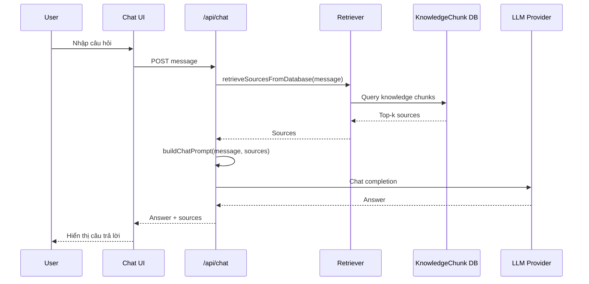

## Phụ lục E. Sơ đồ luồng recommendation

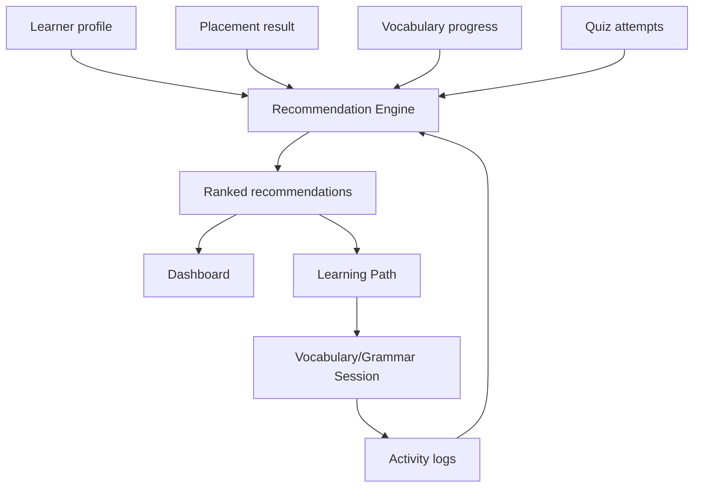

## Phụ lục F. Gợi ý hình ảnh cần chèn khi dàn trang Word

- Ảnh trang onboarding tạo lộ trình.
- Ảnh placement test có context hồ sơ.
- Ảnh learning path với task card.
- Ảnh vocabulary session completion.
- Ảnh grammar session.
- Ảnh chatbot Kami có nguồn tham khảo.
- Ảnh reading/TODAII có furigana và audio.
- Ảnh Playwright test result 6/6 passed.
