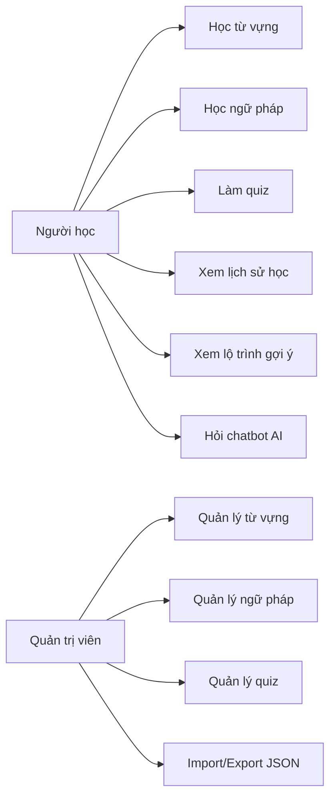
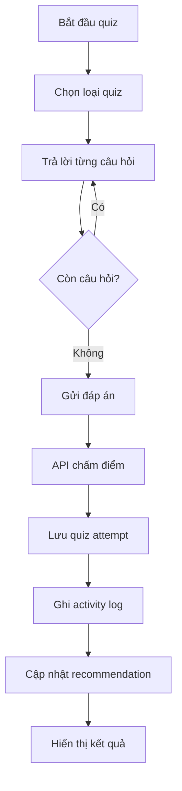
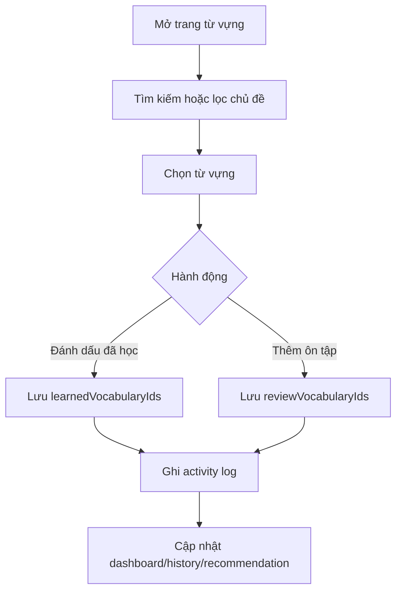
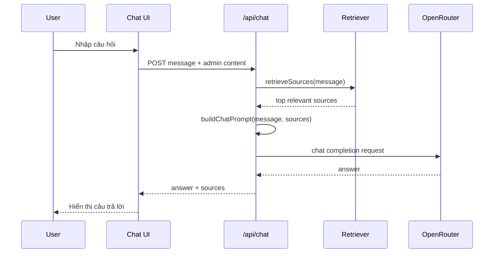
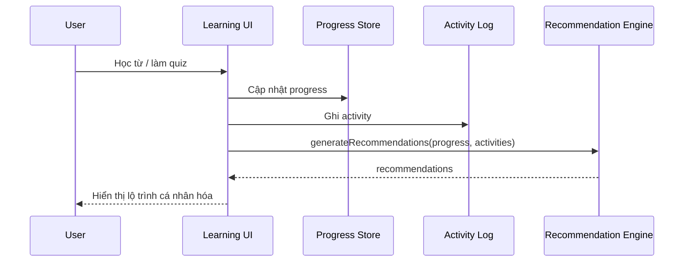
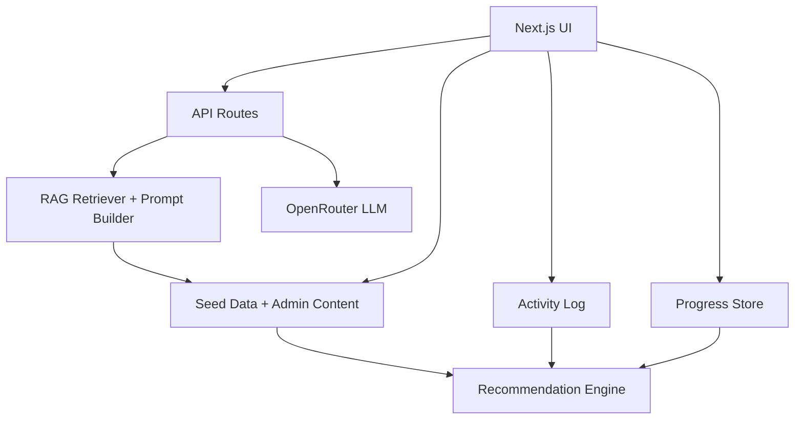

# UML và sơ đồ luồng xử lý

Các sơ đồ dưới đây dùng Mermaid để có thể đưa trực tiếp vào báo cáo hoặc render trong Markdown viewer hỗ trợ Mermaid.

## 1. Use Case Diagram

## 2. Activity Diagram: Làm quiz

## 3. Activity Diagram: Học từ vựng

## 4. Sequence Diagram: Chatbot RAG

## 5. Sequence Diagram: Recommendation

## 6. Component Diagram

